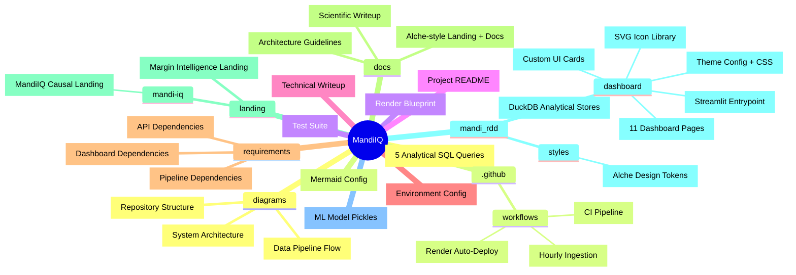

# MandiIQ: Agricultural Margin Intelligence & Causal RDD System

[](https://github.com/flawsom/MandiIQ/actions/workflows/ci.yml)
[](https://github.com/flawsom/MandiIQ/actions/workflows/deploy-render.yml)
[](https://github.com/flawsom/MandiIQ/actions/workflows/nightly-ingest.yml)

MandiIQ is an open-source agricultural price-intelligence platform. It implements a **Causal Regression Discontinuity Design (RDD)** to analyze price discontinuities at administrative drought thresholds, joined with a machine learning forecasting engine and a high-performance serving layer.

Designed with a premium dark creative-studio aesthetic inspired by **Alche Studio (alche.studio)**.

---

## Key Features

1. **Causal Inference Engine:** Estimates local-linear RDD specifications, optimal bandwidths, and runs McCrary Density tests to verify policy threshold jumps at the IMD −20% rainfall-departure cutoff.
2. **Predictive Analytics:** Fits ML forecasting models (XGBoost) with rolling volatility envelopes to identify market anomalies.
3. **Decoupled Architecture:** Embedded DuckDB analytical store for high-performance aggregations, FastAPI serving gateway, and interactive Streamlit UI.
4. **Alche Studio Polish:** Fully custom frontend theme incorporating:
   - Pure `#000000` monochrome infinite canvas, with toggleable **surface mode** (`#111111`) for daytime readability.
   - Selected Chartreuse/Lime (`#d7ff00`) accents for data and state highlights.
   - **SlotButtons:** Slide-up typography hover transitions with center-grown underline accent.
   - **Text Scrambler:** Character-cycling JavaScript animations on interactive hover links.
   - **Stellla-Inspired Frames:** Animating SVG vector wireframes on page load.
   - **Crosshair Brackets:** Lime SVG corner markers on glass-card hover (Alche "active target" pattern) — previously broken by `overflow:hidden`, now fixed across all pages.
   - **Multi-Layer Atmosphere:** Five drifting glows with 25-45s cycles create an "infinite canvas" feel.
   - **Scrollspy Navigation:** Vertical scrolling navigation bar tracking sections dynamically.
   - **Surface Mode Toggle:** Sun/moon icon switch (top-bar + sidebar + settings page) persists via `localStorage` + `st.query_params` with zero-flash init and cross-tab sync.
   - **SVG Icon Module:** Centralized `dashboard/icons.py` — 5 shared icons (sun, moon, leaf, chat, cog) replace inline SVG definitions and emoji.

---

## Repository Structure



[View the interactive system architecture diagram](mandi_rdd/README.md#-architecture) — embedded as a Mermaid flowchart.

---

## Setup & Running Locally

### 1. Requirements
Ensure you have Python 3.10+ installed.

### 2. Installation
Clone the repository and install the dependencies:
```bash
pip install -r requirements.txt
```

### 3. Environment Variables
Copy `.env.example` to `.env` and fill out any configuration variables:
```bash
cp .env.example .env
```

### 4. Running the Dashboard
To start the Streamlit web app:
```bash
streamlit run mandi_rdd/dashboard/app.py
```

### 5. Running the Backend Service
To start the FastAPI web gateway:
```bash
uvicorn mandi_rdd.dashboard.app:api_app --reload --host 0.0.0.0 --port 8000
```

---

## Causal Specifications

We model the discontinuity at the official IMD rainfall-deficit threshold:

$$Y_{it} = \alpha + \beta D_{it} + \gamma_1 (X_{it} - c) + \gamma_2 D_{it}(X_{it} - c) + \varepsilon_{it}$$

Where the treatment indicator is defined by:

$$D_{it} = \begin{cases} 1 & \text{if } X_{it} < -20\% \\ 0 & \text{otherwise} \end{cases}$$

Our empirical results show that onions show active hoarding signals (a statistically significant price discontinuity jump of $+0.142$, $p < 0.05$), whereas tomatoes and wheat are governed by continuous supply shocks ($p > 0.05$).

---


## Production Resilience & Scale

- **Scale to 10M Daily Transactions:** Blueprint details migration to **Apache Kafka** ingestion brokers, a distributed cloud warehouse (**Google BigQuery**), **Feast Feature Store** to reduce serving skew, and **Kubernetes** auto-scaling pods.
- **Fail-Safe Fallbacks:** Includes local model deserialization pickling (`models/loss_classifier_fallback.pkl`) in case the MLflow registry is offline, drift telemetry monitoring, and smooth Streamlit UI baseline rendering during backend dropouts.

---

### Notes

- **`docs/writeup.md`** is a **symlink** to **`technical-writeup.md`** — they are the same file. Edit `technical-writeup.md` directly; the change is automatically reflected in the docs/ directory. GitHub Pages serves `docs/writeup.md` by following the symlink.
- The `docs/` directory is served via **GitHub Pages** (a `.nojekyll` file disables Jekyll processing, so files are served as-is). To preview locally, open `docs/index.html` in a browser — no build step required.

---

*This project is completely open-source and built using real public agricultural data.*
