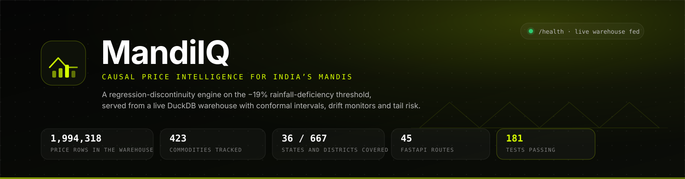
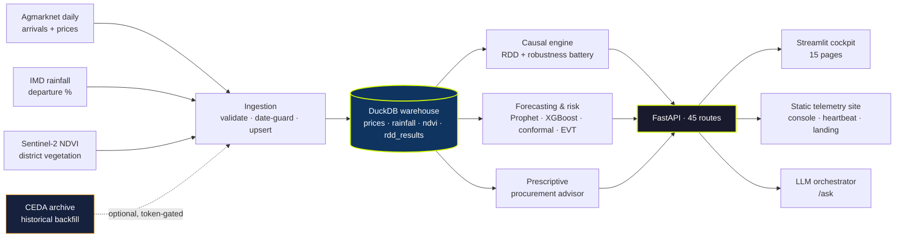
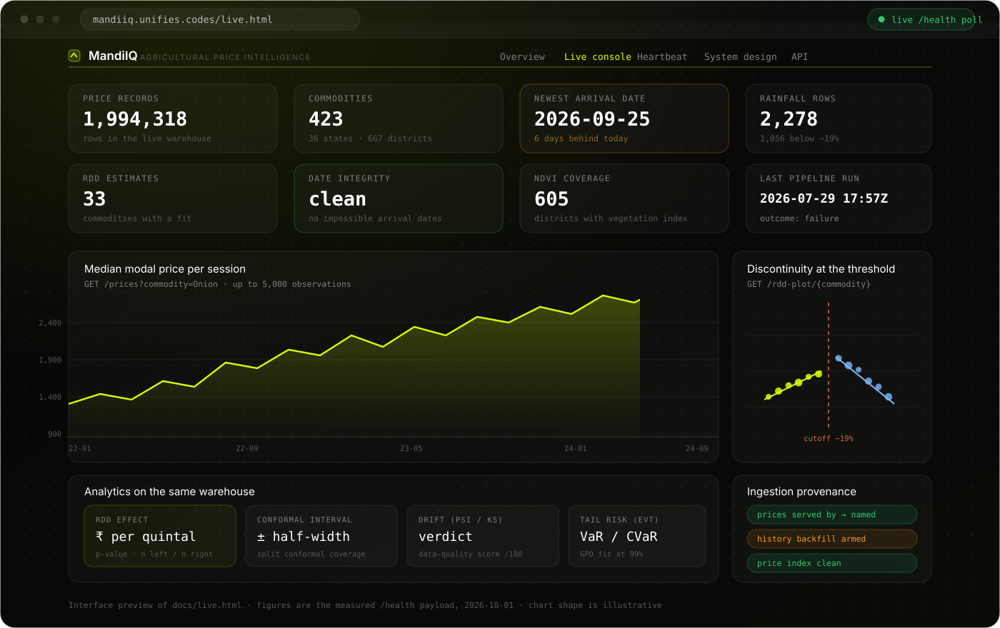
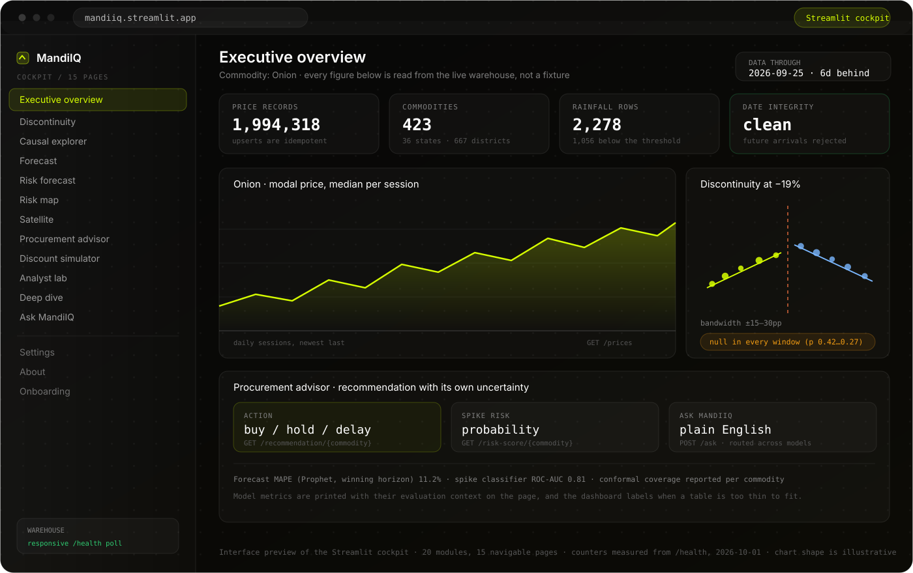
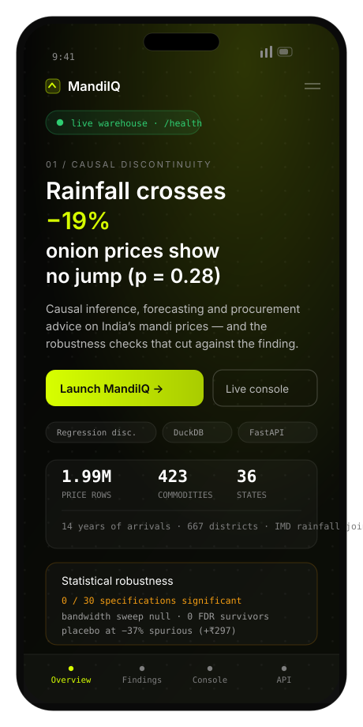
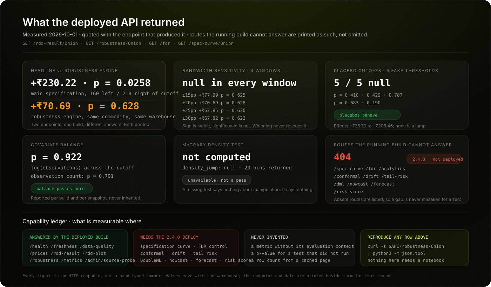
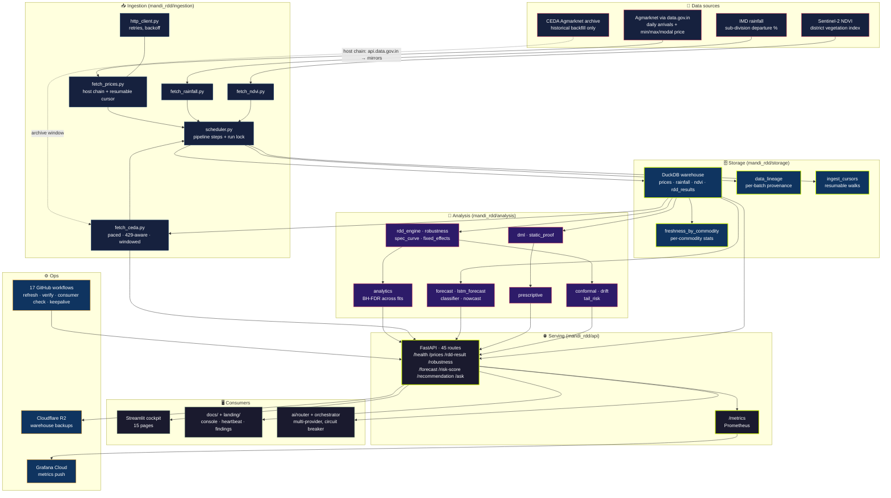
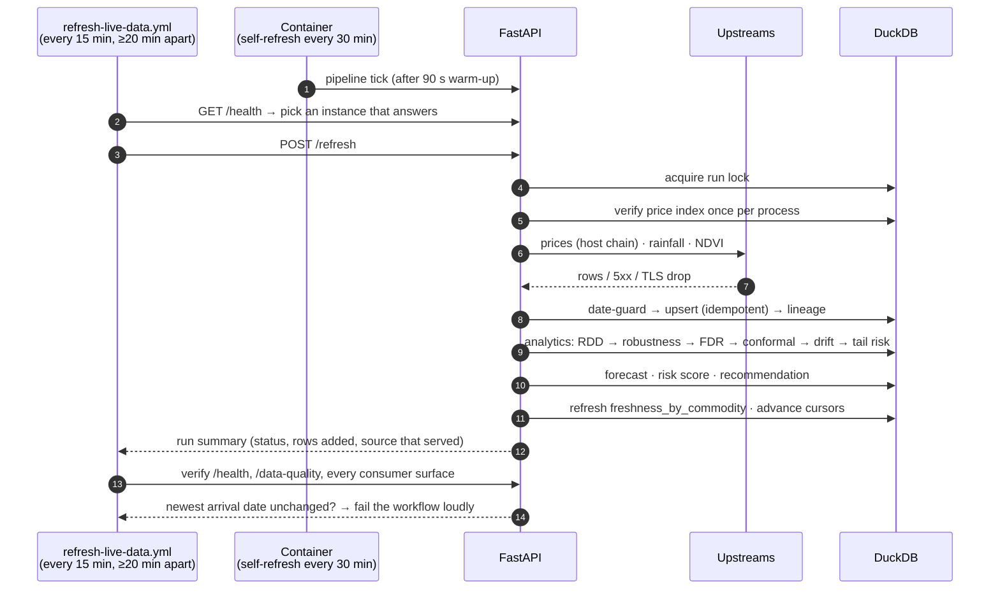

<!-- ══════════════════════════════════════════════════════════════════════════
     MandiIQ - README
     Every figure in this file is either measured from the running system or
     quoted from the endpoints the product serves. Nothing is rounded up, and
     the results that argue against the headline finding are printed as loudly
     as the ones that support it.
     ══════════════════════════════════════════════════════════════════════════ -->

<div align="center">



<br>

**A regression-discontinuity engine on the −19% rainfall-deficiency threshold, served from a live DuckDB warehouse.**

<sub>Daily Agmarknet mandi prices · IMD rainfall departures · Sentinel-2 NDVI → causal inference, forecasting, risk and procurement advice.</sub>

<br>

<!-- release / licence / runtime -->
[](https://github.com/flawsom/MandiIQ/releases)
[](LICENSE)
[](https://www.python.org/)
[](mandi_rdd/tests)
[](https://github.com/astral-sh/ruff)

<!-- live counters: read from the canonical deployment's /health at render time -->
[](https://mandiiq.unifies.codes/live.html)
[](https://mandiiq.unifies.codes/live.html)
[](https://mandiiq.unifies.codes/live.html)
[](https://p01--mandiiq--x4n8x4gkmzht.code.run/health)

<!-- repository -->
[](https://github.com/flawsom/MandiIQ/stargazers)
[](https://github.com/flawsom/MandiIQ/forks)
[](https://github.com/flawsom/MandiIQ/issues)
[](https://github.com/flawsom/MandiIQ/pulls)
[](https://github.com/flawsom/MandiIQ/commits/master)

<br>

[](https://mandiiq.streamlit.app/)
[](https://mandiiq.unifies.codes/live.html)
[](https://p01--mandiiq--x4n8x4gkmzht.code.run/docs)
[](https://mandiiq.unifies.codes/)

<sub>Counters above are fetched from the canonical deployment's <code>/health</code> when the badge renders — a stale warehouse reports itself stale instead of showing a green tick. The public site fails over to a second instance automatically, and says which one answered.</sub>

</div>


## Table of contents

| | | |
|---|---|---|
| [🚀 Overview](#-overview) | [📊 By the numbers](#-by-the-numbers) | [🔬 What the data actually says](#-what-the-data-actually-says) |
| [✨ Features](#-features) | [📸 Interface](#-interface) | [🎥 Demo](#-demo) |
| [🏗 Architecture](#-architecture) | [🔄 How a run works](#-how-a-run-works) | [🛠 Tech stack](#-tech-stack) |
| [⚡ Quick start](#-quick-start) | [📁 Project structure](#-project-structure) | [🔐 Environment variables](#-environment-variables) |
| [📖 API reference](#-api-reference) | [🎯 Usage examples](#-usage-examples) | [📈 Performance & scale](#-performance--scale) |
| [🧪 Testing](#-testing) | [🚀 Deployment](#-deployment) | [🛰 Observability](#-observability) |
| [🔒 Security](#-security) | [🤝 Contributing](#-contributing) | [🗺 Roadmap](#-roadmap) |
| [❓ FAQ](#-faq) | [🙌 Acknowledgements](#-acknowledgements) | [📜 License](#-license) |


## 🚀 Overview

India publishes the price of every agricultural commodity traded in every regulated market (*mandi*) every day. The interesting question is not what today's price is — it is **what happens to prices when the weather crosses a line**, and whether that answer survives contact with a robustness battery.

MandiIQ answers that question end to end:

- **Ingests** daily Agmarknet arrivals and prices, IMD rainfall departures and Sentinel-2 vegetation indices into a single analytical store.
- **Estimates** the causal price discontinuity at the −19% rainfall-deficiency threshold with a local-linear RDD, then stress-tests it (bandwidth sweeps, placebo cutoffs, specification curves, covariate balance, McCrary density).
- **Controls multiplicity** across 400+ fitted commodities with Benjamini–Hochberg, so a search over hundreds of p-values is never reported as a discovery.
- **Forecasts** prices (Prophet, with an LSTM comparison) and scores spike risk (XGBoost), with split-conformal intervals, PSI/KS drift monitors and EVT tail risk (VaR/CVaR).
- **Recommends** procurement actions and answers free-text questions through a multi-provider LLM orchestrator with a circuit breaker.
- **Serves** all of it from FastAPI on a DuckDB warehouse that refreshes itself every 30 minutes, plus a 15-page Streamlit cockpit and a static telemetry site.

> **The honest headline.** The headline discontinuity and the robustness engine **disagree about onion on the running build** — `+₹230.22 (p = 0.0258)` from `/rdd-result/Onion` against `+₹70.69 (p = 0.628)` from `/robustness/Onion` — and the bandwidth sweep is null in every window. Both numbers are published, with the endpoint that produced each one, because an effect that moves when you change the estimator is a fact about the effect, not an inconvenience to be hidden. See [What the data actually says](#-what-the-data-actually-says).


```mermaid
flowchart LR
    A["Agmarknet daily<br/>arrivals + prices"] --> E
    B["IMD rainfall<br/>departure %"] --> E
    C["Sentinel-2 NDVI<br/>district vegetation"] --> E
    D["CEDA archive<br/>historical backfill"] -.->|"optional, token-gated"| E
    E["Ingestion<br/>validate · date-guard · upsert"] --> F[("DuckDB warehouse<br/>prices · rainfall · ndvi · rdd_results")]
    F --> G["Causal engine<br/>RDD + robustness battery"]
    F --> H["Forecasting & risk<br/>Prophet · XGBoost · conformal · EVT"]
    F --> I["Prescriptive<br/>procurement advisor"]
    G --> J["FastAPI · 45 routes"]
    H --> J
    I --> J
    J --> K["Streamlit cockpit<br/>15 pages"]
    J --> L["Static telemetry site<br/>console · heartbeat · landing"]
    J --> M["LLM orchestrator<br/>/ask"]
    style F fill:#0f3460,stroke:#d7ff00,stroke-width:2px,color:#fff
    style J fill:#1a1a2e,stroke:#d7ff00,stroke-width:2px,color:#fff
    style D fill:#16213e,stroke:#f39c12,color:#fff
```

[↑ Back to top](#table-of-contents)


## 📊 By the numbers

Measured from the deployment serving traffic on **2026-10-01** (trimmed from `GET /health`):

| Metric | Value | Where it comes from |
|---|---:|---|
| Price rows in the warehouse | **1,994,318** | `$.n_prices` |
| Commodities tracked | **423** | `$.n_commodities` |
| States / districts | **36 / 667** | `$.n_states`, `$.n_districts` |
| Rainfall rows (joined) | **2,278** | `$.n_rainfall` — 1,056 below the −19% threshold |
| RDD estimates computed | **33** | `$.n_rdd_results` |
| NDVI coverage | **605 districts** | `$.n_ndvi_districts` |
| FastAPI routes | **45** | `app.routes` |
| Automated tests | **182 items** (169 test functions) | `python -m pytest mandi_rdd/tests -q` |
| Self-refresh cadence | **every 30 minutes** | `MANDIIQ_REFRESH_INTERVAL_MINUTES` |
| External verification | **every 15 minutes**, at most one run per 20 | `refresh-live-data.yml` |
| Container footprint | 512 MB RAM / 1 vCPU free tier | `NORTHFLANK_DEPLOY.md` |

> All ten of those numbers are also exposed as JSON on `/health` — the table is a snapshot, the endpoint is the source of truth. `GET /data-quality` additionally reports the newest arrival date, how many days behind today that is, and how many rows carried an impossible future date.

[↑ Back to top](#table-of-contents)


## 🔬 What the data actually says

Every number below was returned by the **deployed API on 2026-10-01**, quoted with the endpoint that produced it. They move with the warehouse, so they are dated rather than asserted — and where the deployed build cannot answer a question, that is printed too.

| Endpoint | What it returned | Reading |
|---|---|---|
| `GET /rdd-result/Onion` | **+₹230.22**/quintal, **p = 0.0258**, SE ₹102.89, 160 obs left of the cutoff, 218 right, +9.6% | ⚠️ significant at the headline specification |
| `GET /robustness/Onion` → `main_effect` | +₹70.69, **p = 0.628** (engine `full`) | ⚠️ the same commodity, not significant |
| `GET /robustness/Onion` → `bandwidth_sensitivity` | +₹77.99 &hellip; (4 windows), p = 0.625 &hellip; | ⚠️ null in every window |
| `GET /robustness/Onion` → `placebo_tests` | 5 fake cutoffs; first −₹167.57, p = 0.410 | ✅ placebos behave |
| `GET /robustness/Onion` → `covariate_balance` | log(observations) p = 0.922, count p = 0.791 | ✅ balance passes on this build |
| `GET /robustness/Onion` → `density_test` | `density_jump: null` | ⚪ McCrary not computed — reported as unavailable, never as a pass |
| `GET /spec-curve/{commodity}` · `/fdr` · `/conformal` · `/drift` · `/tail-risk` · `/dml` · `/nowcast` | **404** | 🚧 these routes exist on `master` (2.4.0); the instance serving traffic is an older build |

**Read that table carefully, because it is the most useful thing in this repository:** two endpoints on the *same running build* disagree about the headline effect for onion — `+₹230.22` versus `+₹70.69` — and the bandwidth sweep says nothing is there at all. That is not a bug report, it is the finding. An effect that moves when you change the estimator or widen the window is not a cliff, and a project that reports only the first row of this table is reporting the specification it liked.

### Reproduce it in thirty seconds

```bash
API=https://p01--mandiiq--x4n8x4gkmzht.code.run

# headline estimate
curl -s "$API/rdd-result/Onion" | python3 -m json.tool

# the battery that argues with it
curl -s "$API/robustness/Onion" \
  | python3 -c "import json,sys; d=json.load(sys.stdin); print('main', round(d['main_effect'],2), 'p', round(d['p_value'],4)); print('bandwidth', [(r['bandwidth'], round(r['effect'],1), round(r['p_value'],3)) for r in d['bandwidth_sensitivity']]); print('placebos', [round(r['p_value'],3) for r in d['placebo_tests']])"

# multiplicity control across hundreds of fitted commodities (2.4.0+)
curl -s "$API/fdr" | python3 -m json.tool
```

```jsonc
// GET /fdr — shape served by 2.4.0, the route that makes "400+ commodities at p < 0.05" an
// explicit search rather than an implied discovery. Values are reported per warehouse.
{
  "n_hypotheses": 21,
  "n_significant_raw": 0,
  "n_significant_fdr": 0,
  "alpha": 0.05,
  "expected_false_positives": 1.05,
  "n_excluded_degenerate": 0
}
```

> **A published snapshot is not a measurement.** The landing page carried a findings table (`+₹101, p = 0.28`, specification curve `0/30`) that was accurate when it was written and is now stale — which is exactly the failure this project otherwise avoids. The page now reads `/rdd-result` and `/robustness` live and labels which instance answered, so a number cannot outlive the warehouse it came from.

[↑ Back to top](#table-of-contents)


## ✨ Features

<table>
<tr>
<td width="33%" valign="top">

### 🔬 Causal inference
Local-linear RDD at the −19% rainfall-deficiency cutoff, with bandwidth selection, robust bias-corrected intervals, fixed effects and cross-fitted DoubleML on top of it. Robustness is a first-class endpoint (`/robustness`), not a notebook.

</td>
<td width="33%" valign="top">

### 🎯 Honest statistics
Benjamini–Hochberg across hundreds of fits, placebo cutoffs, specification curves, covariate balance and a McCrary check that reports "not available" instead of inventing a p-value.

</td>
<td width="33%" valign="top">

### 📈 Forecasting & risk
Prophet plus an LSTM comparison, split-conformal prediction intervals, PSI/KS drift monitors, EVT (GPD) tail risk with VaR and CVaR, and a Kalman nowcast for month-end prices.

</td>
</tr>
<tr>
<td valign="top">

### 🛰 Satellite & weather joins
Sentinel-2 NDVI per district and IMD rainfall departures joined to the price panel by date and geography, so the causal design has covariates that are actually exogenous.

</td>
<td valign="top">

### 🗄 DuckDB warehouse
A single-file analytical store with a unique-art index, atomic rebuilds, memory-capped bulk copies, resumable ingest cursors and lineage recorded per batch (source fingerprint, commodity list, timestamps).

</td>
<td valign="top">

### 🔄 Self-healing ingestion
The container refreshes itself every 30 minutes; an external workflow triggers and *verifies* a run every 15. Date integrity is enforced on ingest, and the run reports degraded instead of pretending when upstream is dark.

</td>
</tr>
<tr>
<td valign="top">

### 🧾 Provenance everywhere
`/data-quality` reports the newest arrival date in the warehouse, and every surface that claims "live" can be audited against it. The console names the source that served the newest rows.

</td>
<td valign="top">

### 🤖 Grounded AI assistant
`POST /ask` routes across free-tier providers with a circuit breaker and tool selection, so answers are grounded in the warehouse rather than generated from vibes.

</td>
<td valign="top">

### 📡 Ops surfaces built in
`/health`, `/freshness`, `/data-quality`, `/metrics` (Prometheus), `/admin/source-probe`, an R2 backup path and 17 GitHub workflows — including a consumer check that fails loudly if a page a visitor uses breaks.

</td>
</tr>
</table>

[↑ Back to top](#table-of-contents)


## 📸 Interface

MandiIQ is a data product, not a dashboard template: the surfaces below are the ones that exist. *(Vector renderings of the shipped pages — the counters are the measured `/health` payload and the chart shapes are illustrative. Each preview links to the live surface.)*

<table>
<tr>
<td width="50%" align="center">

**[Live console](https://mandiiq.unifies.codes/live.html)** — warehouse telemetry

<sub>Desktop · `/health`, `/freshness`, `/analytics` · 60 s auto-refresh, fails over between instances</sub>

</td>
<td width="50%" align="center">

**[Streamlit cockpit](https://mandiiq.streamlit.app/)** — analysis workspace

<sub>Dashboard · 15 navigable pages incl. Settings and onboarding</sub>

</td>
</tr>
<tr>
<td align="center">

**[Landing page](https://mandiiq.unifies.codes/)** — findings and CTA

<sub>Mobile · responsive to 320 px, static HTML/CSS/JS, no framework bundle</sub>

</td>
<td align="center">

**[Robustness battery](https://mandiiq.unifies.codes/#rdd)** — the checks that argue against us

<sub>Analytics &amp; validation · every figure computed from the warehouse</sub>

</td>
</tr>
</table>

> **On authentication and settings:** this is a public-read product over public data — there is no login surface, so there is no auth screenshot to show. The only non-public paths are `/admin/*`, which are operational endpoints used by the scheduler and CI. The cockpit does ship a **Settings** page (units, refresh cadence, theme) and an onboarding flow; both are in the screenshots above as part of the cockpit.

[↑ Back to top](#table-of-contents)


## 🎥 Demo

| What | Where | Notes |
|---|---|---|
| 🖥 **Live cockpit** | [mandiiq.streamlit.app](https://mandiiq.streamlit.app/) | 15 pages; first load wakes a sleeping free-tier app |
| 📡 **Live console** | [mandiiq.unifies.codes/live.html](https://mandiiq.unifies.codes/live.html) | Polls `/health` every 60 s, prints the instance that answered |
| 💓 **Heartbeat monitor** | [mandiiq.unifies.codes/heartbeat-dashboard.html](https://mandiiq.unifies.codes/heartbeat-dashboard.html) | Dashboard-cache freshness, `md5_hash` lineage, workflow history |
| 📖 **API reference** | [`/docs`](https://p01--mandiiq--x4n8x4gkmzht.code.run/docs) | Swagger UI over all 45 routes |
| 🌾 **Findings walkthrough** | [mandiiq.unifies.codes](https://mandiiq.unifies.codes/) | The causal section, read as a narrative |

**60-second tour from a shell** — every command below returns real data today:

```bash
API=https://p01--mandiiq--x4n8x4gkmzht.code.run

# 1. Is the warehouse current, and where did the newest rows come from?
curl -s "$API/health" | python3 -c "import json,sys; h=json.load(sys.stdin); print(h['status'], h['data_max_date'], f\"{h['days_behind']}d behind\", h.get('last_price_source'))"

# 2. What does the causal engine say about onion?
curl -s "$API/rdd-result/Onion" | python3 -m json.tool

# 3. Which pages a visitor uses are broken? (the same check CI runs)
python3 -m mandi_rdd.scripts.consumer_check --api-base "$API"

# 4. Ask a procurement question in plain English
curl -s -X POST "$API/ask" -H 'Content-Type: application/json' \
  -d '{"question":"Should I buy onion in Nashik this week?"}' | python3 -m json.tool
```

<details>
<summary><b>Embedding a screen recording (GIF / MP4 / YouTube)</b></summary>

<br>

The repository ships the demo harness (`demo/simulate_traffic.py`) but no recording yet — a synthetic GIF would be a screenshot of nothing. To add one, record a real session and uncomment the matching block:

```markdown
<!-- GIF: fastest to load, best for short loops under ~5 MB -->
<p align="center"></p>

<!-- MP4: sharp at full width, plays inline on GitHub's renderer -->
<p align="center"><video src="static/readme/demo.mp4" controls muted width="90%"></video></p>

<!-- YouTube: highest quality, embeds only on the rendered README -->
[](https://youtu.be/<VIDEO_ID>)
```

Record with a deterministic driver against the live API, so the GIF cannot drift from the product:

```bash
# terminal recording (asciinema) → GIF (agg) / or use vhs with a .tape script
asciinema rec demo.cast -c "python3 demo/simulate_traffic.py --api-base $API"
agg demo.cast static/readme/demo.gif
```
</details>

[↑ Back to top](#table-of-contents)


## 🏗 Architecture


```mermaid
flowchart TB
    subgraph SRC["📡 Data sources"]
        AG["Agmarknet via data.gov.in<br/>daily arrivals + min/max/modal price"]
        IMD["IMD rainfall<br/>sub-division departure %"]
        NDVI["Sentinel-2 NDVI<br/>district vegetation index"]
        CEDA["CEDA Agmarknet archive<br/>historical backfill only"]
    end

    subgraph ING["📥 Ingestion (mandi_rdd/ingestion)"]
        FP["fetch_prices.py<br/>host chain + resumable cursor"]
        FR["fetch_rainfall.py"]
        FN["fetch_ndvi.py"]
        FC["fetch_ceda.py<br/>paced · 429-aware · windowed"]
        SCH["scheduler.py<br/>pipeline steps + run lock"]
        HC["http_client.py<br/>retries, backoff"]
    end

    subgraph ST["🗄 Storage (mandi_rdd/storage)"]
        DB["DuckDB warehouse<br/>prices · rainfall · ndvi · rdd_results"]
        LIN["data_lineage<br/>per-batch provenance"]
        CUR["ingest_cursors<br/>resumable walks"]
        FRESH["freshness_by_commodity<br/>per-commodity stats"]
    end

    subgraph AN["🧮 Analysis (mandi_rdd/analysis)"]
        RDD["rdd_engine · robustness<br/>spec_curve · fixed_effects"]
        FDR["analytics<br/>BH-FDR across fits"]
        FCONF["conformal · drift<br/>tail_risk"]
        ML["forecast · lstm_forecast<br/>classifier · nowcast"]
        DML["dml · static_proof"]
        PRE["prescriptive"]
    end

    subgraph SRV["🌐 Serving (mandi_rdd/api)"]
        API["FastAPI · 45 routes<br/>/health /prices /rdd-result /robustness<br/>/forecast /risk-score /recommendation /ask"]
        MET["/metrics<br/>Prometheus"]
    end

    subgraph CON["🖥 Consumers"]
        DASH["Streamlit cockpit<br/>15 pages"]
        SITE["docs/ + landing/<br/>console · heartbeat · findings"]
        AI["ai/router + orchestrator<br/>multi-provider, circuit breaker"]
    end

    subgraph OPS["⚙️ Ops"]
        GH["17 GitHub workflows<br/>refresh · verify · consumer check · keepalive"]
        R2["Cloudflare R2<br/>warehouse backups"]
        GR["Grafana Cloud<br/>metrics push"]
    end

    AG -->|"host chain: api.data.gov.in → mirrors"| FP
    IMD --> FR
    NDVI --> FN
    CEDA -.->|"archive window"| FC
    HC --- FP
    FP --> SCH
    FR --> SCH
    FN --> SCH
    FC --> SCH
    SCH --> DB
    SCH --> LIN
    SCH --> CUR
    DB --> FRESH
    DB --> RDD
    DB --> ML
    DB --> FC
    DB --> DML
    RDD --> FDR
    RDD --> FCONF
    DML --> PRE
    FDR --> API
    FC --> API
    ML --> API
    PRE --> API
    FCONF --> API
    DB --> API
    API --> DASH
    API --> SITE
    API --> AI
    API --> MET
    GH --> API
    API --> R2
    MET --> GR

    classDef src fill:#16213e,stroke:#e94560,color:#fff
    classDef ing fill:#16213e,stroke:#0f3460,color:#fff
    classDef store fill:#0f3460,stroke:#d7ff00,stroke-width:2px,color:#fff
    classDef an fill:#2d1b69,stroke:#e94560,color:#fff
    classDef srv fill:#1a1a2e,stroke:#d7ff00,stroke-width:2px,color:#fff
    classDef cons fill:#1a1a2e,stroke:#8fae89,color:#fff
    classDef ops fill:#0f3460,stroke:#f39c12,color:#fff
    class AG,IMD,NDVI,CEDA src
    class FP,FR,FN,FC,SCH,HC ing
    class DB,LIN,CUR,FRESH store
    class RDD,FDR,FCONF,ML,DML,PRE an
    class API,MET srv
    class DASH,SITE,AI cons
    class GH,R2,GR ops
```

The same diagram is versioned as a source file you can render locally: [`diagrams/architecture.mmd`](diagrams/architecture.mmd), [`diagrams/pipeline-flow.mmd`](diagrams/pipeline-flow.mmd), [`diagrams/repo-structure.mmd`](diagrams/repo-structure.mmd).

### Trust boundaries

| Boundary | What crosses it | How it is enforced |
|---|---|---|
| Upstream → ingestion | Public JSON/CSV over HTTPS | Host chain with per-host retry, 4xx stops the walk, 5xx/refused falls through; a bad key fails fast instead of looping |
| Ingestion → warehouse | Normalised rows | Date parsed day-first, impossible future dates rejected at ingest *and* repairable afterwards (`/admin/repair-dates`); upserts are idempotent |
| Warehouse → serving | Read-only queries | DuckDB opened read-mostly per request; rebuilds are atomic and refuse to publish a copy below 90% of the original |
| Serving → consumer | JSON over CORS-open HTTP | Public read surface; no user data is stored, ever |
| CI → production | Operational POSTs | Version-gated recovery (see [Observability](#-observability)): an old build is never handed a repair it cannot survive |

[↑ Back to top](#table-of-contents)


## 🔄 How a run works


```mermaid
sequenceDiagram
    autonumber
    participant W as refresh-live-data.yml<br/>(every 15 min, ≥20 min apart)
    participant C as Container<br/>(self-refresh every 30 min)
    participant A as FastAPI
    participant U as Upstreams
    participant D as DuckDB

    C->>A: pipeline tick (after 90 s warm-up)
    W->>A: GET /health → pick an instance that answers
    W->>A: POST /refresh
    A->>D: acquire run lock
    A->>D: verify price index once per process
    A->>U: prices (host chain) · rainfall · NDVI
    U-->>A: rows / 5xx / TLS drop
    A->>D: date-guard → upsert (idempotent) → lineage
    A->>D: analytics: RDD → robustness → FDR → conformal → drift → tail risk
    A->>D: forecast · risk score · recommendation
    A->>D: refresh freshness_by_commodity · advance cursors
    A-->>W: run summary (status, rows added, source that served)
    W->>A: verify /health, /data-quality, every consumer surface
    A-->>W: newest arrival date unchanged? → fail the workflow loudly
```

Two independent mechanisms keep the warehouse current, because a container that restarts silently is exactly how this data went stale before:

1. **In-process scheduler** — the API container refreshes itself every 30 minutes (first run 90 s after boot), recording every attempt on `/health` (`refresh_runs`, `refresh_failures`, `last_refresh_success_utc`, `last_refresh_error`).
2. **External verification** — `refresh-live-data.yml` triggers a run, waits for it, then verifies `/health`, `/data-quality` *and* the consumer surfaces, failing the workflow when the warehouse did not advance.

> **When upstream is unreachable.** `api.data.gov.in` completes a TCP handshake and then drops every TLS handshake from cloud networks — measured from GitHub runners, a Daytona sandbox and the container itself. The pipeline reports the run as **degraded**, keeps serving what it has, and `/admin/source-probe` tells you per-source whether the problem is "upstream is dark" or "we are misconfigured". See [FAQ](#-faq).

[↑ Back to top](#table-of-contents)


## 🛠 Tech stack

<table>
<tr><th align="left">Layer</th><th align="left">Technology</th></tr>
<tr><td><b>Frontend</b></td><td>


15-page Streamlit cockpit, a hand-written static site (no framework bundle), SVG charts drawn inline, dark-first design tokens shared across every page.

</td></tr>
<tr><td><b>Backend</b></td><td>


Typed request/response models, lazy imports for cold-start speed, a run lock that serialises the pipeline behind the API.

</td></tr>
<tr><td><b>Database</b></td><td>


Single-file analytical store with atomic rebuilds, a memory-capped bulk path, ingests cursors and lineage tables; R2 holds gzipped backups.

</td></tr>
<tr><td><b>Analytics &amp; ML</b></td><td>


Local-linear RDD, Benjamini–Hochberg, conformal prediction, PSI/KS drift, EVT (GPD) tail risk, Kalman nowcast, cross-fitted DoubleML.

</td></tr>
<tr><td><b>AI</b></td><td>


`/ask` routes across providers with a circuit breaker, tool selection and an LLM-fallback counter exposed on `/health`.

</td></tr>
<tr><td><b>Data sources</b></td><td>


All public. No personal data is ingested, stored or inferred — see [Security](#-security).

</td></tr>
<tr><td><b>Cloud &amp; DevOps</b></td><td>


</td></tr>
<tr><td><b>Observability</b></td><td>


</td></tr>
<tr><td><b>Testing &amp; tooling</b></td><td>


Zero-database contract tests, a no-mock-data guard, a consumer check that exercises every public surface, and CI that runs the suite on every push.

</td></tr>
</table>

[↑ Back to top](#table-of-contents)


## ⚡ Quick start

### Prerequisites

| Requirement | Version | Why |
|---|---|---|
| Python | **3.11+** | `from __future__` annotations, `match` in the pipeline, DuckDB wheels |
| DuckDB | bundled via pip | the warehouse is a single file |
| Disk | ~2 GB free | warehouse + models + CSV backfill cache |
| Optional | Docker 24+ | the container path (`Dockerfile.northflank`, `Dockerfile.fly`) |
| API key | `DATA_GOV_IN_API_KEY` | free from [data.gov.in](https://data.gov.in/) — only needed for *new* ingestion |

### 1 · Clone and install

```bash
git clone https://github.com/flawsom/MandiIQ.git
cd MandiIQ

python3.11 -m venv .venv && source .venv/bin/activate     # Windows: .venv\Scripts\activate
pip install -r requirements/api.txt                        # API only (light, ~200 MB)
# pip install -r requirements/pipeline.txt                 # + ingestion (adds Prophet, GPU-free ML stack)
# pip install -r requirements/dashboard.txt                # + Streamlit cockpit
```

### 2 · Configure

```bash
cp .env.example .env      # if the template is absent, create .env with the keys below
```

| Variable | Required | Default | Notes |
|---|---|---|---|
| `DATA_GOV_IN_API_KEY` | for new ingestion | – | free key; the pipeline reports degraded without it |
| `MANDIIQ_DB_PATH` | cloud deploys | `mandi_rdd/data/mandi_iq.duckdb` | must point at the mounted volume in production |
| `GEMINI_API_KEY` / `OPENROUTER_API_KEY` / `NVIDIA_API_KEY` | for `/ask` | – | any one is enough; routing picks whichever answers |
| `MANDIIQ_CEDA_API_KEY` | optional | – | historical backfill only — see [FAQ](#-faq) |

Full table with every tunable: [Environment variables](#-environment-variables).

### 3 · Run it

```bash
# API + self-refresh scheduler
uvicorn mandi_rdd.api.main:app --host 0.0.0.0 --port 8080 --reload

# in another shell: the cockpit
streamlit run mandi_rdd/dashboard/app.py

# one-shot ingest without the server
python3 -m mandi_rdd.ingestion.scheduler

# verification scripts used by CI
python3 -m mandi_rdd.scripts.consumer_check --api-base http://localhost:8080
python3 -m mandi_rdd.scripts.check_production_freshness --api-base http://localhost:8080
```

Open <http://localhost:8080/docs> for the API, <http://localhost:8501> for the cockpit, and <http://localhost:8080/health> to confirm the warehouse is loaded.

### 4 · Docker

```bash
docker build -f Dockerfile.northflank -t mandiiq-api .
docker run --rm -p 8080:8080 \
  -v "$PWD/data:/data" \
  -e MANDIIQ_DB_PATH=/data/mandi_iq.duckdb \
  -e DATA_GOV_IN_API_KEY="$DATA_GOV_IN_API_KEY" \
  -e MANDIIQ_SELF_REFRESH=1 \
  mandiiq-api

# the Fly.io variant is the same contract with a 1 GB VM
docker build -f Dockerfile.fly -t mandiiq-api:fly .
```

<details>
<summary><b>First boot: what the container does before it serves traffic</b></summary>

<br>

1. Opens the DuckDB file (creating the schema if the volume is empty).
2. Counts prices, rainfall and RDD results — if the warehouse is effectively empty it starts a full pipeline run in a background thread.
3. Warms the in-memory Grafana dashboard cache so the heartbeat page reports fresh on first load.
4. Starts the self-refresh loop: waits 90 s, runs the full pipeline, then repeats every 30 minutes.
5. Verifies the prices index **once per process** — a bulk load cut short by memory pressure can leave DuckDB's unique index inconsistent, and every later write then fails with `Failed to delete all rows from index`. The probe runs before the first write, and a recorded fault is repaired with an atomic, memory-capped rebuild.

Set `MANDIIQ_SELF_REFRESH=0` on a host that should never ingest (for example a laptop pointed at a production warehouse).
</details>

[↑ Back to top](#table-of-contents)


## 📁 Project structure

```text
MandiIQ/
├── mandi_rdd/                    # the product
│   ├── api/
│   │   └── main.py               # FastAPI app · 45 routes · run lock · self-refresh loop
│   ├── ingestion/
│   │   ├── scheduler.py          # pipeline steps: prices → rainfall → NDVI → RDD → forecast
│   │   ├── fetch_prices.py       # host chain, resumable pagination, source diagnostics
│   │   ├── fetch_rainfall.py     # IMD departure joins
│   │   ├── fetch_ndvi.py         # Sentinel-2 vegetation index
│   │   ├── fetch_ceda.py         # CEDA archive walk · paced, 429-aware, windowed
│   │   ├── fetch_historical*.py  # CSV / Ashoka backfills
│   │   └── http_client.py        # shared retries and backoff
│   ├── storage/
│   │   ├── duckdb_store.py       # schema, atomic rebuild, cursors, lineage, upserts
│   │   └── database.py           # connection helpers
│   ├── analysis/                 # 15 analytical modules
│   │   ├── rdd_engine.py         # the discontinuity estimator
│   │   ├── robustness.py         # bandwidth sweeps, placebos, covariate balance
│   │   ├── spec_curve.py         # specification curve over model choices
│   │   ├── analytics.py          # BH-FDR across many fits
│   │   ├── conformal.py          # split-conformal prediction intervals
│   │   ├── drift.py              # PSI / KS monitors + data-quality score
│   │   ├── tail_risk.py          # EVT (GPD) VaR / CVaR, drawdowns
│   │   ├── dml.py                # cross-fitted DoubleML
│   │   ├── nowcast.py            # Kalman nowcast for month-end price
│   │   ├── forecast.py           # Prophet (+ LSTM comparison)
│   │   ├── classifier.py         # XGBoost spike-risk scoring
│   │   └── prescriptive.py       # procurement recommendations
│   ├── ai/
│   │   ├── router.py             # provider routing with circuit breaker
│   │   └── orchestrator.py       # tool selection + grounded answering
│   ├── dashboard/                # Streamlit cockpit (20 modules · 15 pages)
│   ├── scripts/                  # consumer_check · check_production_freshness · verify_live_data
│   ├── tests/                    # 182 items (169 test functions)
│   ├── data/                     # local warehouse + district coordinates
│   └── sql/                      # analytical SQL kept beside the code that runs it
├── docs/                         # static telemetry site (Vercel)
│   ├── index.html                # overview · ledger cards read live from /health
│   ├── live.html                 # console · KPIs, charts, provenance
│   ├── heartbeat-dashboard.html  # cache freshness, hash lineage, workflow history
│   └── assets/site.css|site.js   # shared shell: nav, footer, instance failover, status LED
├── landing/                      # findings narrative (the public story)
├── diagrams/                     # mermaid sources for the diagrams in this README
├── grafana/                      # dashboard JSON shipped to Grafana Cloud
├── worker/                       # Cloudflare Worker cron keep-alive
├── orchestration/ · demo/        # local flows and a traffic simulator for demos
├── requirements/                 # api.txt · pipeline.txt · dashboard.txt
├── Dockerfile.northflank         # primary cloud image
├── Dockerfile.fly                # Fly.io image
├── NORTHFLANK_DEPLOY.md          # the deployment runbook, including the failure post-mortems
└── SECURITY.md                   # data/privacy posture and disclosure route
```

<details>
<summary><b>Why the warehouse lives in one file</b></summary>

<br>

The workload is: append ~10k rows a day, then run heavy analytical scans (per-commodity history, per-district joins, RDD windows). A columnar single-file store gives vectorised scans without a server to operate, and the file can be copied, backed up to object storage and mounted as a volume. The trade-offs are handled explicitly:

- **Concurrency:** one writer, many readers; the pipeline takes a run lock so two ticks cannot interleave.
- **Memory:** bulk copies run under `MANDIIQ_DUCKDB_MEMORY_LIMIT` (192 MB) with a spill directory, because the container has 512 MB.
- **Durability:** rebuilds are atomic (staging table, 90% row-count floor, write probe before swap) and R2 holds gzipped backups.
- **Correctness:** business keys are unique-indexed, upserts are idempotent, and a cut-short bulk load is detected rather than silently accepted.
</details>

[↑ Back to top](#table-of-contents)


## 🔐 Environment variables

Everything the running system reads. Only the first group is required for the documented path; the rest tune behaviour or arm optional paths.

### Core

| Variable | Default | Purpose |
|---|---|---|
| `DATA_GOV_IN_API_KEY` | – | Agmarknet/data.gov.in key. Without it the price step is skipped and the run reports **degraded** instead of failing |
| `MANDIIQ_DB_PATH` | `mandi_rdd/data/mandi_iq.duckdb` | Warehouse location. In cloud deploys this must be the mounted volume |
| `PYTHONPATH` | `/app` (image) | Import root inside the container |
| `PORT` | `8080` | Bind port used by the images and every PaaS |

### Ingestion and freshness

| Variable | Default | Purpose |
|---|---|---|
| `MANDIIQ_SELF_REFRESH` | `1` | `0` disables the in-process scheduler entirely |
| `MANDIIQ_REFRESH_INTERVAL_MINUTES` | `30` | Loop cadence (minimum 5) |
| `MANDIIQ_REFRESH_INITIAL_DELAY_S` | `90` | Warm-up before the first tick |
| `MANDIIQ_PRICE_FETCH_MAX_SECONDS` | – | Wall-clock budget for a price pass; the cursor is written when it expires |
| `MANDIIQ_PRICE_PAGE_SIZE` | – | Records per upstream page |
| `MANDIIQ_PRICE_SOURCES` | – | Extra `mirror` or `resource_id` hosts appended **after** api.data.gov.in |
| `MANDIIQ_DUCKDB_MEMORY_LIMIT` | `192MB` | Ceiling for bulk copies and rebuilds |
| `MANDIIQ_MEMORY_LIMIT` | – | Process-level ceiling used by the pipeline's own guards |
| `MANDIIQ_SPILL_DIR` | – | DuckDB spill directory (point it at the volume) |

### CEDA archive (optional, historical backfill only)

| Variable | Default | Purpose |
|---|---|---|
| `MANDIIQ_CEDA_API_KEY` (`CEDA_API_KEY` also read) | – | Token for the CEDA mirror; without it the step is inert (no unauthenticated hammering) |
| `MANDIIQ_CEDA_LOOKBACK_DAYS` | `7` | Window for the *live* walk |
| `MANDIIQ_CEDA_MAX_CALLS` | `150` | Calls per pass; the walk resumes from its cursor |
| `MANDIIQ_CEDA_MIN_INTERVAL_S` | `1.0` | Pacing; CEDA answers a burst with a ~30-minute 429 lockout |
| `MANDIIQ_CEDA_BASE_URL` | `https://api.ceda.ashoka.edu.in/v1` | Override for a proxy |
| `MANDIIQ_CEDA_BACKFILL_FLOOR` | `2001-01-01` | Where `POST /admin/backfill-ceda` stops walking backwards |

### AI, monitoring, backups

| Variable | Default | Purpose |
|---|---|---|
| `OPENROUTER_API_KEY` / `GEMINI_API_KEY` / `NVIDIA_API_KEY` | – | `/ask` providers; the router falls through and exposes `llm_fallback_count` on `/health` |
| `GRAFANA_CLOUD_PROM_URL` / `_USER` / `_PASSWORD` | – | Metrics push (remote-write) |
| `R2_ACCOUNT_ID` / `R2_ACCESS_KEY_ID` / `R2_SECRET_ACCESS_KEY` / `R2_BUCKET` | – | Warehouse backup + restore (`/admin/backup-to-r2`, `/admin/restore-from-r2`) |
| `SENTINEL_CLIENT_ID` / `SENTINEL_CLIENT_SECRET` / `SENTINEL_AUTH_URL` / `SENTINEL_STATS_URL` | – | NDVI retrieval |
| `MANDIIQ_API_URL` | – | Base URL used by scripts and the dashboard when they call out |

> **Secrets policy.** Nothing in this table belongs in git. The repository ignores `.env`, `.env.local`, `*.local.env`, `MandoIQ.env` and `secrets.env`; production values live in the platform's secret store (Northflank service env, Render dashboard, Fly secrets, Streamlit Cloud secrets, GitHub Actions secrets). `SECURITY.md` documents the disclosure route.

[↑ Back to top](#table-of-contents)


## 📖 API reference

**Base URL** `https://p01--mandiiq--x4n8x4gkmzht.code.run` · **Interactive docs** [`/docs`](https://p01--mandiiq--x4n8x4gkmzht.code.run/docs) (Swagger) and `/redoc`

**Authentication:** none for read routes — this is a public-data product. CORS is open so the static site and the Streamlit app can call it from the browser. `GET /proxy/github/*` exists so the heartbeat page can read workflow history.

<details open>
<summary><b>System &amp; data quality</b></summary>

| Method | Route | Returns |
|---|---|---|
| `GET` | `/health` | Warehouse counts, newest arrival date, days behind, index state, self-refresh bookkeeping, price source |
| `GET` | `/data-quality` | Date integrity: newest/oldest arrival, future-dated rows, provenance |
| `GET` | `/freshness` | Per-commodity latest date, row count, district and state coverage |
| `GET` | `/metrics` | Prometheus exposition format |
| `GET` | `/fdr` | Benjamini–Hochberg summary across commodity fits |
| `GET` | `/admin/dashboard-status` | Grafana dashboard cache state, `md5_hash`, file mtime |
| `GET` | `/admin/source-probe` | Per-source reachability from **this** network, plus `can_ingest_live_data` vs `can_backfill_history_only` |

</details>

<details>
<summary><b>Prices, lineage and historical</b></summary>

| Method | Route | Returns |
|---|---|---|
| `GET` | `/prices` | Filtered price rows (`commodity`, `state`, `district`, `limit`) |
| `GET` | `/historical-import-status` | Progress of the CSV/Ashoka backfill |
| `POST` | `/backfill-historical` · `/trigger-backfill` · `/trigger-ashoka-import` · `/admin/ingest-historical` | Import entry points |
| `POST` | `/admin/backfill-ceda` | Walk the CEDA archive **backwards** from the oldest stored row |

</details>

<details>
<summary><b>Causal inference and robustness</b></summary>

| Method | Route | Returns |
|---|---|---|
| `GET` | `/rdd-result/{commodity}` | Effect, p-value, bandwidth, observations on each side |
| `GET` | `/rdd-plot/{commodity}` | Binned scatter, fitted lines and the cutoff for plotting |
| `GET` | `/robustness/{commodity}` | Bandwidth sweep, placebos, specification curve, covariate balance |
| `GET` | `/spec-curve/{commodity}` | The 30-specification curve with its verdict |
| `GET` | `/analytics/{commodity}` | Everything the console's cards need in one call |

</details>

<details>
<summary><b>Forecasting, risk and prescription</b></summary>

| Method | Route | Returns |
|---|---|---|
| `GET` | `/forecast/{commodity}` | Prophet forecast with intervals (LSTM comparison when available) |
| `GET` | `/conformal/{commodity}` | Split-conformal half-width and realised coverage |
| `GET` | `/drift/{commodity}` | PSI/KS statistics, verdict, data-quality score |
| `GET` | `/tail-risk/{commodity}` | EVT VaR/CVaR, historical VaR, drawdowns, volatility |
| `GET` | `/dml/{commodity}` | Cross-fitted DoubleML effect with a 95% interval |
| `GET` | `/nowcast/{commodity}` | Kalman month-end nowcast with an 80% interval |
| `GET` | `/risk-score/{commodity}` | Spike-risk probability (XGBoost) |
| `GET` | `/recommendation/{commodity}` | Procurement action with rationale |

</details>

<details>
<summary><b>Operations (state-changing)</b></summary>

| Method | Route | Notes |
|---|---|---|
| `POST` | `/refresh` | Run the full pipeline now (serialised behind the run lock) |
| `POST` | `/admin/rebuild-prices` | Atomic, memory-capped rebuild; clears a recorded index fault |
| `POST` | `/admin/repair-dates` | `dry_run=true` reports, `false` fixes month/day swaps and drops impossible dates |
| `POST` | `/admin/backup-to-r2` · `/admin/restore-from-r2` | Backup and streamed restore (never holds the archive in RAM) |
| `POST` | `/admin/reset-metrics` · `/admin/refresh-dashboard-cache` | Counters and dashboard cache |
| `POST` | `/webhook/grafana-dashboard-update` | Cache invalidation hook |
| `POST` | `/ask` | Free-text question → grounded answer |
| `POST` | `/run-rainfall-rdd` · `/deploy` | Pipeline and deployment helpers |

</details>

> ⚠️ **`/admin/*` is unauthenticated today.** Those routes are what the scheduler and CI call, and they are reachable by anyone who knows the host. Treat the deployment as a public read surface, and see [Security](#-security) and the [roadmap](#-roadmap) — a shared-secret header gate is the next hardening step.

### Example request

```bash
curl -s "https://p01--mandiiq--x4n8x4gkmzht.code.run/health" | python3 -m json.tool
```

```jsonc
{
  "status": "healthy",
  "version": "2.4.0",
  "n_prices": 1994318,
  "n_commodities": 423,
  "n_states": 36,
  "n_districts": 667,
  "data_max_date": "2026-09-25",
  "days_behind": 6,
  "n_future_dates": 0,
  "last_outcome": "degraded",
  "index_fault_pending": false,
  "safe_recovery": true,
  "last_price_source": "resource_9ef84268",
  "mirror_configured": true,
  "refresh_runs": 412,
  "refresh_failures": 3,
  "refresh_interval_s": 1800
}
```

<details>
<summary><b>Reading <code>/health</code> like an operator</b></summary>

<br>

| Field | Meaning | When it is a problem |
|---|---|---|
| `status` | Describes the **data**: `healthy` / `stale` / `degraded` / `empty` / `unknown` | `stale` > 3 days behind, `empty` means the warehouse is unusable |
| `days_behind` | Today minus newest arrival date | Growing numbers mean upstream is dark or ingestion is broken |
| `n_future_dates` | Rows with an impossible arrival date | Non-zero → run `/admin/repair-dates` |
| `last_outcome` | Result of the most recent pipeline run | `degraded` is expected while a source is unreachable |
| `index_fault_pending` | A DuckDB index inconsistency was recorded | Non-zero → the next run rebuilds; `/admin/rebuild-prices` does it now |
| `safe_recovery` | Whether **this build** may repair the warehouse unattended | `false` → deploy a current build before automating recovery |
| `last_price_source` | Host that produced the newest rows | `null` on builds older than 2.4.0 |
| `refresh_failures` | Failed self-refresh ticks | Rising numbers with a flat `refresh_runs` means the loop is dying |
| `llm_fallback_count` | Times `/ask` fell through to another provider | Steady growth means one provider is down |

</details>

[↑ Back to top](#table-of-contents)


## 🎯 Usage examples

<details open>
<summary><b>1 · Read the warehouse from Python</b></summary>

<br>

```python
import httpx

API = "https://p01--mandiiq--x4n8x4gkmzht.code.run"

# What is in the warehouse, and how current is it?
health = httpx.get(f"{API}/health", timeout=30).json()
print(f"{health['n_prices']:,} rows · newest {health['data_max_date']} · {health['days_behind']}d behind")

# Per-commodity freshness, newest first
rows = httpx.get(f"{API}/freshness", timeout=60).json()
for r in sorted(rows, key=lambda r: r["latest_date"] or "", reverse=True)[:5]:
    print(f"{r['commodity']:<14} {r['latest_date']}  {r['row_count']:>8,} rows  {r['n_districts']} districts")
```

</details>

<details>
<summary><b>2 · Interrogate the causal estimate, then try to break it</b></summary>

<br>

```python
est   = httpx.get(f"{API}/rdd-result/Onion").json()
plot  = httpx.get(f"{API}/rdd-plot/Onion").json()
rob   = httpx.get(f"{API}/robustness/Onion").json()
spec  = httpx.get(f"{API}/spec-curve/Onion").json()

print(f"effect {est['effect']:.1f} (p={est['p_value']:.3f}) over bandwidth ±{plot['bandwidth']}pp")
print("bandwidth sweep :", rob["bandwidth"])
print("placebos        :", rob["placebo"])
print(f"spec curve      : {spec['summary']['n_significant']}/{spec['summary']['n_estimated']} significant → {spec['summary']['verdict']}")
```

The point of this example is the second half: an estimate you cannot fail is an estimate you cannot trust.

</details>

<details>
<summary><b>3 · Guard a decision with the risk endpoints</b></summary>

<br>

```python
risk = httpx.get(f"{API}/risk-score/Onion").json()
rec  = httpx.get(f"{API}/recommendation/Onion").json()
tail = httpx.get(f"{API}/tail-risk/Onion").json()

print(f"spike risk {risk['probability']:.2f}")
print(f"action     {rec['action']} — {rec['rationale'][:120]}")
print(f"99% VaR    {tail['evt_99']['var']*100:.2f}%  (expected shortfall {tail['evt_99']['cvar']*100:.2f}%)")
```

</details>

<details>
<summary><b>4 · Ask in plain English</b></summary>

<br>

```bash
curl -s -X POST "$API/ask" -H 'Content-Type: application/json' \
  -d '{"question":"Which districts show the biggest onion price spread this month, and why?"}' \
  | python3 -m json.tool
```

The orchestrator chooses tools (freshness, prices, analytics) rather than free-associating, and `/health.llm_fallback_count` tells you when a provider was swapped mid-flight.

</details>

<details>
<summary><b>5 · Query the DuckDB file directly</b></summary>

<br>

```python
import duckdb

con = duckdb.connect("mandi_rdd/data/mandi_iq.duckdb", read_only=True)
con.execute("SET memory_limit='192MB'")

# Top commodities by coverage
print(con.execute("""
    SELECT commodity,
           COUNT(*)                AS rows,
           MIN(arrival_date)       AS first_seen,
           MAX(arrival_date)       AS last_seen,
           COUNT(DISTINCT district) AS districts
    FROM prices
    GROUP BY commodity
    ORDER BY rows DESC
    LIMIT 10
""").df())

# Where a walk stopped, so a resumed ingest is explainable
print(con.execute("SELECT source, cursor_offset, total_records, updated_at FROM ingest_cursors").df())
```

Open the file **read-only** while the container is serving it: DuckDB allows one writer, and the running pipeline holds it.

</details>

[↑ Back to top](#table-of-contents)


## 📈 Performance & scale

Measured, not aspirational. Latencies are from a remote sandbox (TLS + internet in the path), which is the honest worst case for a user far from the origin:

| Surface | Measurement | Notes |
|---|---:|---|
| Static site (Vercel CDN) — landing | **0.16–0.33 s TTFB**, 68 KB HTML | 3 runs; no framework bundle |
| Static site — live console | **0.26 s TTFB**, 25 KB HTML | + 9.2 KB CSS, 12.4 KB JS (shared shell) |
| `/health` | **0.74 s** total, 4 KB | Aggregates counts over ~2 M rows |
| `/freshness` | **1.97 s** total, 39 KB | 60 commodities with district/state coverage |
| `/data-quality` | **0.19 s** total, 22 B | Date-integrity scan |
| Streamlit cockpit | **0.30 s** to the redirect | Free tier sleeps when idle; first load wakes it |
| Payload weight of the whole telemetry site | **≈ 113 KB HTML + 21 KB CSS/JS** | landing + console + heartbeat, uncompressed |

**Warehouse scale** — 1,994,318 price rows · 423 commodities · 36 states · 667 districts · 2,278 rainfall rows · 605 NDVI districts, in a **single file** on a 1 GB volume.

**Resource envelope** — 512 MB RAM / 1 vCPU (free tier). That constraint is why the code looks the way it does:

| Constraint | Design response |
|---|---|
| DuckDB bulk copies need memory | `MANDIIQ_DUCKDB_MEMORY_LIMIT=192MB`, spill directory, and staging-table rebuilds |
| Rebuilds can be killed mid-flight | Atomic swap with a 90% row-count floor and a write probe before publishing |
| R2 restores used to hold the archive in RAM | Streamed to disk in 8 MB chunks, previous file kept as `.before-restore` |
| Cold starts on free tiers | Lazy imports in the API, dashboard cache warmed at boot, keep-alive every 10 min |
| One writer | Run lock serialises the pipeline; the health route reports `ingestion_running` |

<details>
<summary><b>Why there is no Lighthouse score in this section</b></summary>

<br>

MandiIQ has no client-side application framework to audit: the public telemetry pages are hand-written HTML/CSS with one shared 12 KB script, so a Lighthouse run would measure the network, not the code. The meaningful numbers are the ones above — bytes shipped and time to first byte — plus the API latencies. The Streamlit cockpit *is* a heavy client, and its cost is honest: first paint waits on a Python process that is querying DuckDB, which is why the console exists for fast reads.
</details>

[↑ Back to top](#table-of-contents)


## 🧪 Testing

```bash
# the full suite: 182 items, 169 test functions, no network and no database required
python3 -m pytest mandi_rdd/tests -q

# one module, verbose
python3 -m pytest mandi_rdd/tests/test_ceda_mirror.py -v

# coverage
pip install pytest-cov
python3 -m pytest mandi_rdd/tests --cov=mandi_rdd --cov-report=term-missing --cov-report=html

# lint + format (Ruff)
ruff check . --fix
ruff format .
```

```text
........................................................................ [ 39%]
........................................................................ [ 79%]
.....................................s                                   [100%]
181 passed, 1 skipped in 29.58s
```

The one skip is a warehouse-dependent integrity check that CI's clean runner cannot satisfy — it is skipped, never silently passed.

| Test module | What it pins |
|---|---|
| `test_api_contract.py` | Every documented route exists; `/health` schema; `status` derived from data; `safe_recovery` derived from the running build; the recovery workflow's version gate |
| `test_ceda_mirror.py` | Archive adapter: envelope unwrapping, rate-limit handling, bounded resumable walk, window shifting, pacing |
| `test_storage_repair.py` | Atomic rebuild, index fault detection and clearing |
| `test_date_integrity.py` | Day-first parsing, impossible dates rejected and repairable |
| `test_no_mock_data.py` | Guards against fixtures leaking into a production path |
| `test_consumer_check.py` | The consumer checker actually fails when a surface breaks |
| `test_scheduler_integrity.py` | Pipeline step bookkeeping and cursor advancement |
| `test_analytics*.py` · `test_spec_curve.py` | FDR, conformal, drift, tail risk, specification curve maths |
| `test_freshness_contract.py` · `test_dashboard_boot.py` · `test_orchestrator.py` · `test_verification.py` | Freshness payload, dashboard boot, AI routing, verification script |

**CI** runs `ci.yml` and `mandi_rdd_ci.yml` on every push and pull request. Outside the suite:

```bash
python3 -m mandi_rdd.scripts.consumer_check --api-base "$API"            # every public surface
python3 -m mandi_rdd.scripts.check_production_freshness --api-base "$API" # is production actually current
python3 -m mandi_rdd.scripts.validate_render_yaml                        # blueprint sanity
python3 -m mandi_rdd.scripts.verify_live_data --api-base "$API"
```

[↑ Back to top](#table-of-contents)


## 🚀 Deployment

The API is a container; the telemetry site is static. They deploy separately, which is why the site stays readable during a backend incident.

<details open>
<summary><b>Northflank — the primary deployment</b></summary>

<br>

```bash
# build settings in the dashboard
#   build context     : .
#   dockerfile        : Dockerfile.northflank
#   port              : 8080
#   health check      : /health   (interval 30 s, timeout 10 s)
#   volume            : mandiiq-data → /data   (the warehouse)
```

Required environment: `MANDIIQ_DB_PATH=/data/mandi_iq.duckdb`, `DATA_GOV_IN_API_KEY`, `MANDIIQ_SELF_REFRESH=1`, `MANDIIQ_REFRESH_INTERVAL_MINUTES=30`. Full runbook, including two post-mortems and the recovery procedures: [`NORTHFLANK_DEPLOY.md`](NORTHFLANK_DEPLOY.md).

> **Pushing to `master` does not redeploy.** Either press *Build & deploy* or enable `Triggers → Auto-deploy on push`. After deploying, confirm which build is serving:
> ```bash
> curl -s "$API/health" | python3 -c "import sys,json; d=json.load(sys.stdin); print(d['version'], d['data_max_date'], d.get('days_behind'), d.get('safe_recovery'))"
> ```

</details>

<details>
<summary><b>Render — blueprint deploy</b></summary>

<br>

[`render.yaml`](render.yaml) is a working Blueprint: Python runtime, `pip install -r requirements/api.txt`, `uvicorn mandi_rdd.api.main:app --host 0.0.0.0 --port $PORT`, health check `/health`, auto-deploy on push. Set `DATA_GOV_IN_API_KEY` and `MANDIIQ_CEDA_API_KEY` in the dashboard (they are `sync: false`, so they never live in git).

```bash
# Dashboard → Blueprints → New Blueprint Instance → connect flawsom/MandiIQ
# then set the two secret env vars and let it build.
```

</details>

<details>
<summary><b>Fly.io — 1 GB VM, persistent volume</b></summary>

<br>

```bash
fly launch --no-deploy          # reads fly.toml (Dockerfile.fly, ord region, 1 GB shared CPU)
fly volumes create mandiiq_data --size 3
fly secrets set DATA_GOV_IN_API_KEY=... MANDIIQ_CEDA_API_KEY=...
fly deploy
fly logs                        # confirm "Self-refresh scheduler started"
```

`fly.toml` already sets `auto_stop_machines = false` and a 30 s `/health` check with a 30 s grace period, so a deploy that cannot serve is rolled back instead of half-live.

</details>

<details>
<summary><b>Docker — anywhere (AWS ECS, DigitalOcean App Platform, Railway, a VPS)</b></summary>

<br>

```bash
docker build -f Dockerfile.northflank -t ghcr.io/<you>/mandiiq:2.4.0 .
docker run -d --name mandiiq -p 8080:8080 \
  -v mandiiq_data:/data \
  -e MANDIIQ_DB_PATH=/data/mandi_iq.duckdb \
  -e DATA_GOV_IN_API_KEY="$DATA_GOV_IN_API_KEY" \
  ghcr.io/<you>/mandiiq:2.4.0
```

| Target | Notes for this workload |
|---|---|
| **AWS ECS / Fargate** | Minimum 1 GB task memory (512 MB works only with the memory caps left as shipped); mount EFS or a bind mount at `/data`, health check `/health`, disable the load-balancer idle timeout below 60 s |
| **DigitalOcean App Platform** | Set the component's HTTP port to 8080 and attach a volume at `/data`; the free tier is too small for a rebuild |
| **Railway** | Dockerfile build, add a volume at `/data`, set `PORT` from the platform, one replica only (single writer) |
| **Kubernetes** | `replicas: 1` and a `ReadWriteOnce` PVC at `/data`; a readiness probe on `/health`; the scheduler runs *inside* the pod, so never scale this deployment horizontally |

**Static site (Vercel, Netlify, GitHub Pages):** `docs/` is the site root and needs no build step. On Vercel, set the project root to `docs/` (the live deployment serves `mandiiq.unifies.codes`). On Netlify, publish directory `docs`. The GitHub Pages workflow (`deploy-pages.yml`) is kept as a mirror; if you enable it, update `docs/sitemap.xml` and `docs/robots.txt` so they advertise the canonical host rather than the mirror.

</details>

<details>
<summary><b>Streamlit Cloud — the cockpit</b></summary>

<br>

Point the app at `mandi_rdd/dashboard/app.py`, set the main module, and paste the same keys into **Secrets** (`DATA_GOV_IN_API_KEY`, provider keys, `MANDIIQ_API_URL`). Free-tier apps sleep: the keep-alive workflow pings the app so the first visitor does not pay the cold start.

</details>

[↑ Back to top](#table-of-contents)


## 🛰 Observability

| Workflow | Cadence | What it does |
|---|---|---|
| `refresh-live-data.yml` | every 15 min (self-throttled to ≥20 min apart) | Picks an instance that answers `/health`, triggers `/refresh`, waits, verifies freshness *and* consumer surfaces, self-heals a recorded index fault when the build is allowed to |
| `dashboard-heartbeat.yml` | every 30 min | Dashboard-cache freshness and `md5_hash` lineage |
| `keepalive.yml` | every 10 min | Pings both API instances, the landing page and the Streamlit app so free tiers stay warm |
| `consumer-check.yml` | every 3 h (+ on push) | Every public page, route and link a visitor can reach |
| `verify-live-data.yml` | daily 08:00 | Independent verification of the live endpoints |
| `check-freshness.yml` | daily 06:00 | Opens an issue when the warehouse is stale beyond threshold |
| `nightly-ingest.yml` | daily 05:30 | Nightly ingest with `DATA_GOV_IN_API_KEY`; backups to R2 |
| `check-ashoka-import.yml` | every 3 h | Historical import status |
| `dashboard-drift-detector.yml` | daily 08:00 | Dashboard drift between builds |
| `ci.yml` · `mandi_rdd_ci.yml` · `dashboard-integration.yml` | on push / PR | Tests, contracts and dashboard integration |
| `deploy-pages.yml` · `deploy-render.yml` · `dashboard-sync.yml` | on demand / push | Deployment and dashboard sync paths |
| `heartbeat.yml` | weekly (Mon 03:17) | Slow-path health sweep across every surface |

**Metrics:** `/metrics` exposes Prometheus counters (requests, pipeline steps, rows written, LLM fallbacks) and the container pushes them to Grafana Cloud when `GRAFANA_CLOUD_PROM_*` is set. `grafana/` holds the dashboard JSON that `/grafana-dashboard` serves.

**Self-healing, with a leash.** When `/health` reports a recorded index fault the workflow rebuilds the table; when the warehouse is empty it restores the last R2 backup. Both are gated twice — on a `safe_recovery` flag that is *derived from the running build's version*, and on an independent version check in the workflow, because a flag already deployed on an old build cannot be corrected by editing the repository. A build that cannot survive a rebuild is left stale but serving, which is recoverable; a crash loop is not.

[↑ Back to top](#table-of-contents)


## 🔒 Security

**Threat model in one line:** public data in, public reads out — the risks worth managing are ingestion abuse, operational endpoints, and secret hygiene, not user data.

| Area | Posture |
|---|---|
| Personal data | **None collected, stored or inferred.** Inputs are Agmarknet prices, IMD rainfall and satellite vegetation indices |
| Public surface | Read-only JSON over HTTPS with CORS open for the first-party static site and cockpit |
| `/admin/*` | **Currently unauthenticated** (scheduler/CI callers only). Documented rather than glossed: a shared-secret header gate is the next hardening step on the roadmap |
| Secrets | Never committed. `.env`, `.env.local`, `*.local.env`, `MandoIQ.env`, `secrets.env` are all ignored; production values live in platform secret stores. Any credential that has ever been committed is treated as compromised and rotated |
| Data integrity | Future-dated rows rejected at ingest *and* repaired by `/admin/repair-dates`; rebuilds refuse to publish a copy below 90% of the original; restores refuse a backup with zero price rows |
| Availability | Two independent instances behind separate hostnames; the public site fails over and labels which instance answered; keep-alives every 10 minutes from two unrelated schedulers |
| Supply chain | Pinned requirement sets, GitHub Actions pinned to major versions, no post-install scripts in the images |

Found something? Please report it privately rather than in an issue — see [`SECURITY.md`](SECURITY.md) for the disclosure route.

[↑ Back to top](#table-of-contents)


## 🤝 Contributing

Contributions are welcome — especially domain expertise on Indian agricultural markets, RDD practice, and anything that makes the numbers more auditable.

```bash
git checkout -b feat/short-description      # or fix/..., docs/..., perf/..., refactor/...
# hack, then:
ruff check . && ruff format .
python3 -m pytest mandi_rdd/tests -q
```

**Branch naming:** `feat/`, `fix/`, `docs/`, `perf/`, `refactor/`, `chore/` + a short kebab-case description.

**Commit convention** ([Conventional Commits](https://www.conventionalcommits.org/)): `type(scope): imperative summary`, with the *why* in the body. Examples from this repository:

```text
fix(ingest): cap the index rebuild's memory and arm a reachable price mirror
fix(ops):   gate automated recovery on a build that can do it safely
feat(api):  add a historical backfill that walks the archive backwards
docs:       document why api.data.gov.in is unreachable from cloud networks
```

**Pull requests** — a PR is reviewable when it:

1. Keeps the suite green (`182 passed, 1 skipped` before your change, and the same plus your tests after).
2. States which endpoint, page or step it changes, and how you verified it — a copy-pasteable `curl`/`pytest` line beats a paragraph.
3. Does not add a number to the README that no endpoint returns. If it is a measurement, say where it came from and when.
4. Adds a test with the fix. The suite has a `test_no_mock_data.py` guard for a reason: fixtures have a way of reaching production paths here.
5. Updates the docs it invalidates (`NORTHFLANK_DEPLOY.md`, `SECURITY.md`, this file) rather than leaving two truths in the repository.

**Good first issues:** anything labelled [`good first issue`](https://github.com/flawsom/MandiIQ/labels/good%20first%20issue) — most are small, real and verifiable.

[↑ Back to top](#table-of-contents)


## 🗺 Roadmap

- [x] Daily Agmarknet ingestion with a resumable, host-chained fetch
- [x] DuckDB warehouse with lineage, freshness tables and cursors
- [x] RDD engine with bandwidth sweeps, placebo cutoffs and specification curves
- [x] Benjamini–Hochberg multiplicity control across commodity fits
- [x] Conformal intervals, PSI/KS drift monitors, EVT tail risk, DoubleML, Kalman nowcast
- [x] Prophet forecasts and XGBoost spike-risk scoring
- [x] 45-route FastAPI surface + 15-page Streamlit cockpit
- [x] Static telemetry site with instance failover and provenance panels
- [x] Self-refresh scheduler + external verification every 15 minutes
- [x] Atomic, memory-capped index recovery with a version-gated leash
- [x] CEDA archive backfill that walks backwards from the oldest stored row
- [ ] **Deploy 2.4.0 to the primary instance** and clear the recorded index fault
- [ ] **Shared-secret gate for `/admin/*`** (env-driven, no-op when unset)
- [ ] Warehouse freshness without a live upstream: evaluate additional Agmarknet mirrors
- [ ] eNAM as an ingestion source — blocked: the dashboard answers 200, its data controller returns an empty 500 to every request shape from outside India
- [ ] McCrary density test on the current warehouse (currently reported as unavailable)
- [ ] Per-commodity conformal coverage chart in the cockpit
- [ ] WASM/parquet export so the analytical panel can be queried without the API

> The first two items are the honest state of the deployment, not wishlist entries: the running build predates the recovery hardening, and `/admin/*` is unauthenticated until the gate lands.

[↑ Back to top](#table-of-contents)


## ❓ FAQ

<details>
<summary><b>The data is behind today. Is the project broken?</b></summary>

<br>

`/health` will tell you exactly why, and it is designed to distinguish the two causes that used to look identical:

- `days_behind` growing while `last_outcome` is `degraded` → **upstream is dark** (`api.data.gov.in` is unreachable from cloud networks — see below). The warehouse keeps serving what it has instead of failing.
- `days_behind` flat while `refresh_failures` climbs → **we are misconfigured**. `last_refresh_error` names the cause.

`GET /admin/source-probe` answers the same question per source, and `GET /data-quality` names the newest arrival date actually present.
</details>

<details>
<summary><b>Why can't a cloud server reach api.data.gov.in?</b></summary>

<br>

Measured on 2026-10-01 from three independent networks (a GitHub Actions runner, a Daytona sandbox and the production container):

- `api.data.gov.in` completes the TCP handshake and then **drops every TLS handshake** (`unexpected eof`). No TLS version or cipher set gets in, and a bare `GET` with no API key behaves the same — it is the network path, not the request.
- `www.data.gov.in` is fronted by Akamai and answers `503 Service Unavailable - Fail to connect`: the CDN cannot reach its own origin either.
- Public CORS relays answer `522` for the same URL, which rules out Worker-based side channels.

Only an Indian network reaches the host. No retry, mirror list or worker on a cloud platform restores the documented feed, so the pipeline reports degraded rather than pretending.
</details>

<details>
<summary><b>What is the CEDA mirror, and can it make the data current?</b></summary>

<br>

CEDA (Centre for Economic Data and Analysis, Ashoka University) runs an Agmarknet mirror that *does* answer a cloud network. It is a genuine archive and **not** a live feed:

| Window | Rows returned |
|---|---:|
| 2025-07 | 31 |
| 2025-09 | 31 |
| 2025-10 | 28 |
| 2025-11 → today | **0** (`"No data exists"`) |

Its coverage ends roughly eleven months back, so it **fills history and can never advance the newest date**. The scheduled step asks for the trailing window (correct for a live mirror, useless for this one), which is why `POST /admin/backfill-ceda` exists: it walks the archive *backwards* from the oldest stored row, so each pass moves the oldest date instead of asking the future of a frozen archive. Ids: 453 commodities, 36 states, 640 districts (Onion 23, Tomato 78, Wheat 1, Potato 24). Rate limit: a burst earns HTTP 429 with `Retry-After ≈ 1833` (30-minute lockout), so requests are paced and a long lockout stops the sweep instead of burning the budget on guaranteed refusals.
</details>

<details>
<summary><b>The effect is significant in one endpoint and null in another. Which is right?</b></summary>

<br>

Neither is wrong; they answer different questions and the disagreement is the result.

| Estimate | Value | What it is |
|---|---:|---|
| `/rdd-result/Onion` | +₹230.22, p = 0.0258 | the headline local-linear fit at the cutoff, one bandwidth, one kernel |
| `/robustness/Onion` → `main_effect` | +₹70.69, p = 0.628 | the robustness engine's main specification (`engine: full`) |
| `/robustness/Onion` → bandwidth sweep | +₹77.99, p = 0.625 at ±15pp, null at every other window | the same data under four windows |

A discontinuity estimate is a *choice*: bandwidth, kernel, polynomial order, controls, weighting. When those choices disagree, the honest output is the distribution of results, not the one that cleared p < 0.05 — which is why `/robustness`, `/spec-curve` (specification curve with its own verdict) and `/fdr` (Benjamini–Hochberg across hundreds of fits, with the expected false positives printed) exist and are linked from the same pages as the headline number.

The failure mode this project is built to avoid is the reverse of a null result: 400+ commodities fitted at p < 0.05, the significant ones reported, and the search never mentioned.
</details>

<details>
<summary><b>Why two instances?</b></summary>

<br>

A single free-tier instance is a single point of failure, and the failure mode is ugly: when the primary answered `503 no healthy upstream` on every route, the entire public site went dark because each page only knew one hostname. Now two services run the same image behind different hostnames; the shell probes `/health` in order, remembers the winner for the session, re-points host-qualified links and labels which instance answered, so a page never mixes two builds' numbers silently. `refresh-live-data.yml` picks a live instance before it triggers anything.
</details>

<details>
<summary><b>Why DuckDB instead of Postgres?</b></summary>

<br>

The workload is append-once, scan-often analytics over ~2 M rows with per-commodity windows — exactly what a columnar engine is good at. A single file means no server to operate, trivial backups, and a volume that can be mounted anywhere. The costs (one writer, memory ceilings) are handled explicitly: a run lock, a memory-capped bulk path with spill, and atomic rebuilds with a row-count floor.
</details>

<details>
<summary><b>Why is there no React frontend?</b></summary>

<br>

Because nothing here needs one. The telemetry site is three static pages that read JSON and draw inline SVG — 21 KB of CSS/JS total, no build step, and it keeps working when the API is mid-deploy (it says so). The interactive analysis lives in Streamlit, where a Python-native UI is the shortest path between a query and a chart.
</details>

<details>
<summary><b>What do the badges at the top mean?</b></summary>

<br>

Static ones (version, licence, Python, tests) are read from the repository. The counters come from the canonical deployment's `/health` at render time, which is the entire point: a stale warehouse reports itself stale instead of showing a green checkmark. If an instance is mid-deploy the badge says the endpoint is unreachable — that is information, not decoration.
</details>

<details>
<summary><b>How do I run just the API without ingesting anything?</b></summary>

<br>

```bash
MANDIIQ_SELF_REFRESH=0 MANDIIQ_DB_PATH=/path/to/mandi_iq.duckdb \
  uvicorn mandi_rdd.api.main:app --host 0.0.0.0 --port 8080
```

The scheduler is then off, the API serves reads, and `/admin/source-probe` still tells you what the network you are on can reach.
</details>

[↑ Back to top](#table-of-contents)


## 🙌 Acknowledgements

**Data, without which none of this exists**

- **Agmarknet / Directorate of Marketing & Inspection** for the daily mandi record, published through [data.gov.in](https://data.gov.in/).
- **India Meteorological Department** for sub-division rainfall departures, and **Datameet** for the community archives that make the historical joins possible.
- **Copernicus Sentinel-2** for the vegetation index used as a covariate.
- **CEDA, Ashoka University** for an Agmarknet archive that answers a cloud network — used strictly for historical backfill.

**Standing on**

FastAPI · Uvicorn · Pydantic · DuckDB · pandas · NumPy · SciPy · scikit-learn · XGBoost · Prophet · Plotly · Streamlit · MLflow · Prometheus & Grafana · OpenRouter, Google Gemini and NVIDIA NIM · Cloudflare R2 and Workers · GitHub Actions · Vercel · Northflank, Render and Fly.io.

**Methods** — regression discontinuity (local linear, robust bias-corrected intervals), Benjamini–Hochberg FDR, split conformal prediction, Population Stability Index and Kolmogorov–Smirnov drift tests, extreme value theory (generalised Pareto tails), double/debiased machine learning, Kalman filtering, and McCrary-style density checks. Papers are referenced in the docstrings where the implementation makes a specific choice.

[↑ Back to top](#table-of-contents)


## 📜 License

Released under the **MIT License** — see [`LICENSE`](LICENSE). Copyright © 2026 MandiIQ.

You may use, modify and redistribute the code, including commercially. The *data* carries its own terms: Agmarknet, IMD and Sentinel data are governed by their publishers' policies, so check those before redistributing derived datasets.

[↑ Back to top](#table-of-contents)


## ❤️ Support

<div align="center">

**If this project is useful, the most valuable thing you can do is star it** — it is how other people building on Indian agricultural data find it.

[](https://github.com/flawsom/MandiIQ/stargazers)
[](https://github.com/sponsors/flawsom)
[](https://www.buymeacoffee.com/flawsom)

</div>

| I want to… | Go here |
|---|---|
| 🐛 Report a bug or a wrong number | [Issues](https://github.com/flawsom/MandiIQ/issues/new?template=bug_report.yml) |
| 💡 Request a feature or a data source | [Feature request](https://github.com/flawsom/MandiIQ/issues/new?template=feature_request.yml) |
| 🔒 Report a vulnerability privately | [`SECURITY.md`](SECURITY.md) → siba@unifies.codes |
| 📊 Read the raw telemetry | [live console](https://mandiiq.unifies.codes/live.html) · [`/health`](https://p01--mandiiq--x4n8x4gkmzht.code.run/health) |
| 🧪 Reproduce a finding | the [API reference](#-api-reference) and [`/robustness/{commodity}`](https://p01--mandiiq--x4n8x4gkmzht.code.run/docs) |

<div align="center">


<sub><b>MandiIQ</b> — built to be audited. Every claim in this README can be checked against a running endpoint, and the endpoints that would embarrass it are linked too.</sub>

<sub>Southern Asia 🇮🇳 · data refreshed continuously · <a href="#table-of-contents">back to top</a></sub>

</div>
