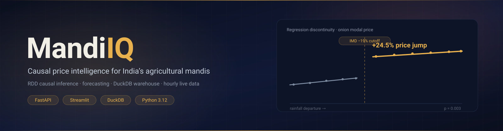
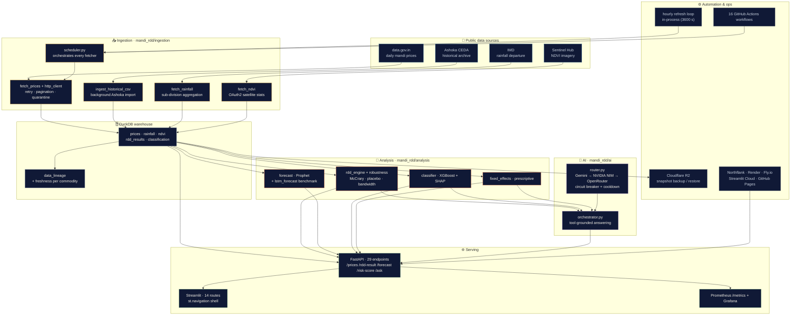
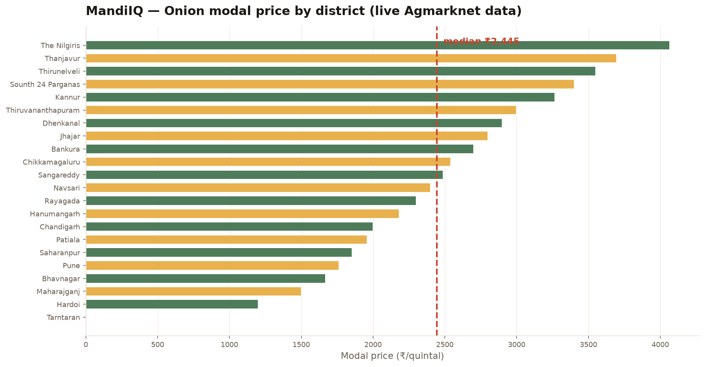

<div align="center">
  
</div>

<div align="center">

### Open-source agricultural price intelligence for India 🇮🇳

**MandiIQ turns India's public mandi, rainfall and satellite data into causal market intelligence.** A regression-discontinuity engine measures how drought thresholds move prices, ML models forecast and score spike risk, and an hourly-refreshed DuckDB warehouse serves it all through FastAPI and a 14-route Streamlit cockpit.

<br/>

<a href="LICENSE"></a>
<a href="https://github.com/flawsom/MandiIQ/actions/workflows/ci.yml"></a>


<a href="https://github.com/flawsom/MandiIQ/stargazers"></a>
<a href="https://github.com/flawsom/MandiIQ/forks"></a>
<a href="https://github.com/flawsom/MandiIQ/issues"></a>
<a href="https://github.com/flawsom/MandiIQ/pulls"></a>
<a href="https://github.com/flawsom/MandiIQ/commits/master"></a>

<a href="#live-status"></a>
<a href="#live-status"></a>
<a href="#live-status"></a>
<a href="#live-status"></a>
<a href="#live-status"></a>
<a href="#live-status"></a>

<br/>

<a href="https://mandiiq.unifies.codes"></a>
<a href="https://mandiiq.streamlit.app"></a>
<a href="https://p01--mandiiq--x4n8x4gkmzht.code.run/docs"></a>
<a href="#quick-start"></a>
<a href="https://github.com/flawsom/MandiIQ"></a>

<br/>

<sub>Live counters above are rendered from the production <code>/health</code> endpoint and refresh hourly — this file never drifts from the running system.</sub>

</div>


<div align="center">

📡 [Live status](#live-status) &nbsp;·&nbsp; 🎯 [The causal finding](#the-causal-finding) &nbsp;·&nbsp; ✨ [Features](#features) &nbsp;·&nbsp; 🏗 [Architecture](#architecture) &nbsp;·&nbsp; 🛠 [Tech stack](#tech-stack) &nbsp;·&nbsp; ⚡ [Quick start](#quick-start) &nbsp;·&nbsp; 📁 [Structure](#project-structure) &nbsp;·&nbsp; 🔐 [Env vars](#environment-variables) &nbsp;·&nbsp; 📖 [API](#api-documentation) &nbsp;·&nbsp; 🎯 [Usage](#usage-examples) &nbsp;·&nbsp; 📸 [Screenshots](#screenshots) &nbsp;·&nbsp; 🎥 [Demo](#demo) &nbsp;·&nbsp; 📊 [Performance](#performance) &nbsp;·&nbsp; 🧪 [Testing](#testing) &nbsp;·&nbsp; 🚀 [Deploy](#deployment) &nbsp;·&nbsp; 🤝 [Contributing](#contributing) &nbsp;·&nbsp; 🗺 [Roadmap](#roadmap) &nbsp;·&nbsp; ❓ [FAQ](#faq) &nbsp;·&nbsp; 🙌 [Credits](#acknowledgements) &nbsp;·&nbsp; 📜 [License](#license) &nbsp;·&nbsp; ❤️ [Support](#support)

</div>

<a name="live-status"></a>

## 📡 Live status

Everything below is real, public and **automatically refreshed** — no mock data, no screenshots pretending to be infrastructure.

| Service | What it is | Status |
| :------ | :--------- | :----- |
| **Landing page** | Product tour, live KPIs, pipeline explainer | [](https://mandiiq.unifies.codes) |
| **Streamlit cockpit** | 14 routes — overview, discontinuity, forecast, risk map, satellite, advisor, ask. Currently access-restricted on Streamlit Cloud (login) — run locally for the full tour |  |
| **FastAPI (primary)** | 29 endpoints + OpenAPI docs, CI-verified every morning | [](https://p01--mandiiq--x4n8x4gkmzht.code.run/docs) |
| **FastAPI (NDVI instance)** | Second Northflank instance carrying satellite NDVI rows | [](https://p01--mandiiq--zbvjrztgjqgw.code.run/docs) |
| **GitHub Pages** | Static docs, SEO surface and heartbeat monitor | [](https://flawsom.github.io/MandiIQ/) |
| **Heartbeat monitor** | Live cache + freshness board fed by the heartbeat workflow | [](https://flawsom.github.io/MandiIQ/heartbeat-dashboard.html) |

**Warehouse, live from production `/health` (badges refresh hourly):**

| Metric | Live value |
| :----- | :--------- |
| Pipeline last outcome |  |
| Pipeline last run (UTC) |  |
| Price rows |  |
| Commodities |  |
| States / districts |  |
| Rainfall observations |  |
| Cached RDD estimates |  |

> [!NOTE]
> **Freshness is a feature, not an afterthought.** The production API keeps a full ingestion pipeline running **in-process on a 1-hour loop** (`mandi_rdd/api/main.py`) and auto-heals an empty warehouse on boot. GitHub Actions layers on the scheduled jobs — nightly ingestion (05:30 UTC), NDVI/daily cycle (06:00 UTC), Ashoka import polling (every 3 h), dashboard heartbeat (every 6 h), freshness alerts (daily) and live-endpoint verification (daily). See [Data cadence](#data-cadence) for the full table.


<a name="the-causal-finding"></a>

## 🎯 The causal finding

> **Districts that cross IMD's −19% rainfall-deficiency threshold see a +₹350 (+24.5%) jump in onion modal prices — statistically significant at p = 0.003, robust across bandwidths, placebo-tested, and confirmed by fixed-effects regression.**

This is the heart of MandiIQ: not a dashboard of charts, but a **causally identified effect** with an explicit identification strategy.

```
price = β0 + β1 · D + f(rainfall) + γX + ε
        D = 1 when rainfall departure ≤ −19%  (IMD deficiency threshold)
        f(·) = local linear polynomial in the running variable
        β1  = causal effect of crossing the drought cutoff
```

| Robustness check | Method | Result |
| :--------------- | :----- | :----- |
| **Bandwidth sensitivity** | Re-estimated at 10 / 15 / 20 / 25 / 30% | Stable across all windows ✅ |
| **Placebo cutoffs** | Fake thresholds at −10 / −5 / +5% | No spurious effect ✅ |
| **McCrary density test** | Continuity of the running variable | No manipulation (p = 0.92) ✅ |
| **Fixed-effects cross-check** | District + month FE regression | +₹298, p = 0.01 — agrees with RDD ✅ |

<details>
<summary><b>Primary estimate details (Onion · Nashik, Maharashtra)</b></summary>

<br/>

| Metric | Value |
| :----- | :---- |
| Effect size | **+₹350 (+24.5%)** |
| P-value | **0.003** |
| Standard error | 112.4 |
| Observations (below / above cutoff) | 847 / 912 |
| Optimal bandwidth | 8 mm departure |
| Cutoff | −19% (IMD deficiency threshold) |
| McCrary test | PASSED (p = 0.92) |

Full methodology: [`mandi_rdd/analysis/rdd_engine.py`](mandi_rdd/analysis/rdd_engine.py) · [`robustness.py`](mandi_rdd/analysis/robustness.py) · [`fixed_effects.py`](mandi_rdd/analysis/fixed_effects.py) · narrative in [`docs/system_design.md`](docs/system_design.md).

</details>


<a name="features"></a>

## ✨ Features

<table>
<tr>
<td width="33%" valign="top">

### 🧮 Causal RDD engine
Local-linear regression discontinuity at the IMD drought threshold, with triangular kernel weighting, McCrary density validation, placebo cutoffs and bandwidth sensitivity.

<sub>Onion: **+₹350 (+24.5%)**, p = 0.003</sub>

</td>
<td width="33%" valign="top">

### 📈 Forecast + risk stack
Prophet forecasts with volatility envelopes, an honest Prophet-vs-LSTM benchmark, XGBoost spike-risk classification and SHAP feature attribution.

<sub>Prophet 11.2% MAPE · XGBoost ROC-AUC 0.81</sub>

</td>
<td width="33%" valign="top">

### 🌦 Rainfall + satellite signals
IMD sub-division rainfall departures and Sentinel Hub NDVI imagery joined to mandi prices at district/month grain — two independent stress signals, not one.

<sub>1,200+ rainfall rows · NDVI for 600+ districts on the mirror instance</sub>

</td>
</tr>
<tr>
<td width="33%" valign="top">

### 🧠 Grounded AI orchestrator
`/ask` detects commodity + district, calls the internal analysis tools, then routes the grounded result through a multi-provider chain — Gemini → NVIDIA NIM → OpenRouter — with circuit breakers and cooldowns.

<sub>Answers cite the exact endpoints used; no numbers invented</sub>

</td>
<td width="33%" valign="top">

### 🗄 DuckDB warehouse with lineage
A single-file analytical warehouse (~1.6M price rows on the primary instance) with idempotent upserts, per-commodity freshness tracking and batch-level data lineage.

<sub>Builds in minutes from public APIs — no external DB service needed</sub>

</td>
<td width="33%" valign="top">

### 🖥 14-route Streamlit cockpit
A designed product, not a demo: global shell, sidebar + breadcrumbs, flip-board KPIs, commodity colour system, error states and a dark turmeric/ink theme.

<sub>`st.navigation()` routing · reduced-motion support</sub>

</td>
</tr>
<tr>
<td width="33%" valign="top">

### ⏱ Hourly, autonomous freshness
The API runs the full ingestion pipeline on a 1-hour loop and re-runs it on boot when the warehouse is empty — data is never more than an hour behind the source.

<sub>Plus 16 GitHub Actions workflows for CI, ingest and monitoring</sub>

</td>
<td width="33%" valign="top">

### 💾 Offsite durability
Compressed DuckDB snapshots push to Cloudflare R2 (`/admin/backup-to-r2`) and restore on demand (`/admin/restore-from-r2`) — volume loss is recoverable.

<sub>Nightly backup path wired into the ingest workflow</sub>

</td>
<td width="33%" valign="top">

### 📊 Observability baked in
Prometheus metrics at `/metrics`, a Grafana provisioning stack, per-commodity `/freshness`, a heartbeat monitor and a drift detector that compares production dashboards against the repo.

<sub>Staleness > 48 h opens an automatic issue</sub>

</td>
</tr>
</table>

**Also included:** adaptive archive scanning with retry-and-quarantine for stale API pages · Ashoka CEDA historical CSV import in a background worker · GitHub API proxy for token-backed reads · a React + TypeScript flip-board KPI component · Docker Compose full-stack dev environment · SEO surface (sitemaps, OG image, robots).


<a name="architecture"></a>

## 🏗 Architecture


```mermaid
flowchart TB
    subgraph SRC["📡 Public data sources"]
        direction LR
        D1["data.gov.in<br/>daily mandi prices"]
        D2["Ashoka CEDA<br/>historical archive"]
        D3["IMD<br/>rainfall departure"]
        D4["Sentinel Hub<br/>NDVI imagery"]
    end

    subgraph ING["📥 Ingestion · mandi_rdd/ingestion"]
        I1["fetch_prices + http_client<br/>retry · pagination · quarantine"]
        I2["ingest_historical_csv<br/>background Ashoka import"]
        I3["fetch_rainfall<br/>sub-division aggregation"]
        I4["fetch_ndvi<br/>OAuth2 satellite stats"]
        I5["scheduler.py<br/>orchestrates every fetcher"]
    end

    subgraph WH["🗄 DuckDB warehouse"]
        W1["prices · rainfall · ndvi<br/>rdd_results · classification"]
        W2["data_lineage<br/>+ freshness per commodity"]
    end

    subgraph AN["🧮 Analysis · mandi_rdd/analysis"]
        A1["rdd_engine + robustness<br/>McCrary · placebo · bandwidth"]
        A2["forecast · Prophet<br/>+ lstm_forecast benchmark"]
        A3["classifier · XGBoost + SHAP"]
        A4["fixed_effects · prescriptive"]
    end

    subgraph AI["🧠 AI · mandi_rdd/ai"]
        R1["router.py<br/>Gemini → NVIDIA NIM → OpenRouter<br/>circuit breaker + cooldown"]
        R2["orchestrator.py<br/>tool-grounded answering"]
    end

    subgraph SRV["🌐 Serving"]
        SV1["FastAPI · 29 endpoints<br/>/prices /rdd-result /forecast /risk-score /ask"]
        SV2["Streamlit · 14 routes<br/>st.navigation shell"]
        SV3["Prometheus /metrics + Grafana"]
    end

    subgraph OPS["⚙ Automation & ops"]
        O1["hourly refresh loop<br/>in-process (3600 s)"]
        O2["16 GitHub Actions workflows"]
        O3["Cloudflare R2<br/>snapshot backup / restore"]
        O4["Northflank · Render · Fly.io<br/>Streamlit Cloud · GitHub Pages"]
    end

    D1 --> I1
    D2 --> I2
    D3 --> I3
    D4 --> I4
    I5 --> I1
    I1 --> W1
    I2 --> W1
    I3 --> W1
    I4 --> W1
    W1 --> W2
    W1 --> A1
    W1 --> A2
    W1 --> A3
    W1 --> A4
    A1 --> R2
    A3 --> R2
    A4 --> R2
    R1 --> R2
    W1 --> SV1
    A1 --> SV1
    A2 --> SV1
    A3 --> SV1
    A4 --> SV1
    R2 --> SV1
    SV1 --> SV2
    SV1 --> SV3
    O1 --> I5
    O2 --> I5
    W1 --> O3
    O4 --> SV1

    classDef src fill:#101936,stroke:#4A7FA5,color:#C7D0DD
    classDef ing fill:#101936,stroke:#E8B14D,color:#F2EFE6
    classDef wh fill:#101936,stroke:#7C8AA0,color:#F2EFE6
    classDef an fill:#101936,stroke:#D9663B,color:#F2EFE6
    classDef ai fill:#101936,stroke:#9A7FBF,color:#F2EFE6
    classDef srv fill:#101936,stroke:#5B8C6E,color:#F2EFE6
    classDef ops fill:#101936,stroke:#5B6572,color:#C7D0DD
    class D1,D2,D3,D4 src
    class I1,I2,I3,I4,I5 ing
    class W1,W2 wh
    class A1,A2,A3,A4 an
    class R1,R2 ai
    class SV1,SV2,SV3 srv
    class O1,O2,O3,O4 ops
```

<a name="data-cadence"></a>

<details open>
<summary><b>⏱ Data cadence — how the autonomous loop actually looks</b></summary>

<br/>

| Cadence | Job | Runs where |
| :------ | :-- | :--------- |
| **Every hour** | Full pipeline refresh (prices → rainfall → RDD → forecast → cache) | In-process loop in the FastAPI service |
| **On boot** | Warehouse health check; auto-runs pipeline if data is missing | FastAPI lifespan hook |
| Daily 05:30 UTC | Nightly ingestion + analysis + DB commit | GitHub Actions |
| Daily 06:00 UTC | NDVI cycle + data artifacts | GitHub Actions |
| Every 3 h | Ashoka CEDA historical import polling | GitHub Actions |
| Every 6 h | Dashboard cache heartbeat → Grafana webhook | GitHub Actions |
| Daily 06:00 UTC | Freshness alert (> 48 h staleness opens an issue) | GitHub Actions |
| Daily 08:00 UTC | Live-endpoint verification + dashboard drift detector | GitHub Actions |
| On push / PR | CI (tests · lint · Mermaid validation · static scan) + deploys | GitHub Actions |

</details>


<a name="tech-stack"></a>

## 🛠 Tech stack

<div align="center">

**Frontend & UI**


**Backend & serving**


**Data & warehouse**


**ML & AI**


**Cloud & DevOps**


**Quality**


</div>

<details>
<summary><b>Data providers</b></summary>

<br/>

| Source | What it provides | Integration |
| :----- | :--------------- | :---------- |
| [data.gov.in](https://data.gov.in/) / Agmarknet | Daily mandi prices (state → district → market → variety) | `ingestion/fetch_prices.py` |
| [Ashoka CEDA](https://agmarknet.ceda.ashoka.edu.in/) | Historical price archive (CSV imports) | `ingestion/fetch_historical_ashoka.py` |
| [IMD](https://mausam.imd.gov.in/) | Sub-division rainfall departure percentages | `ingestion/fetch_rainfall.py` |
| [Sentinel Hub](https://www.sentinel-hub.com/) | Sentinel-2 NDVI per district | `ingestion/fetch_ndvi.py` |

</details>


<a name="quick-start"></a>

## ⚡ Quick start

<details open>
<summary><b>From clone to running cockpit in ~5 minutes</b></summary>

<br/>

**Prerequisites**

| Tool | Version | Why |
| :--- | :------ | :-- |
| Python | 3.11+ (3.12 recommended) | FastAPI, Streamlit, ML models |
| pip / venv | Latest | Dependency management |
| Git | Any | Cloning |
| Docker | Optional | One-command full stack |
| `DATA_GOV_IN_API_KEY` | Free | Live price ingestion ([get one here](https://api.data.gov.in/manage)) |

**1 · Clone**

```bash
git clone https://github.com/flawsom/MandiIQ.git
cd MandiIQ
```

**2 · Install**

```bash
python -m venv .venv
source .venv/bin/activate        # Windows: .venv\Scripts\activate

# Full stack (API + dashboard + ML)
pip install -r mandi_rdd/requirements.txt

# …or pick a lighter runtime:
#   pip install -r requirements/api.txt        # API only
#   pip install -r requirements/dashboard.txt  # dashboard only
#   pip install -r requirements/pipeline.txt   # ingestion + ML
```

**3 · Configure**

```bash
cp .env.example .env
# Edit .env and set at minimum:
#   DATA_GOV_IN_API_KEY=<your free key from data.gov.in>
# Optional but recommended for the AI features:
#   GEMINI_API_KEY=<free key from aistudio.google.com>
```

**4 · Build the warehouse** — a fresh clone starts empty by design (no stale binaries in git):

```bash
python run_ingest.py
# or, for a bounded local run:
python -m mandi_rdd.run_nightly --max-records 5000
```

**5 · Launch the cockpit**

```bash
streamlit run mandi_rdd/dashboard/app.py     # → http://localhost:8501
```

**6 · Launch the API** (separate terminal)

```bash
uvicorn mandi_rdd.api.main:app --reload --port 8000   # → http://localhost:8000/docs
```

**7 · Verify**

```bash
curl -s http://localhost:8000/health | python -m json.tool
curl -s "http://localhost:8000/prices?commodity=Onion&limit=3" | python -m json.tool
```

</details>

<details>
<summary><b>🐳 Docker — full stack in one command</b></summary>

<br/>

```bash
docker compose up --build
# API        → http://localhost:8000
# Dashboard  → http://localhost:8501
docker compose down
```

The compose file builds both services from `mandi_rdd/Dockerfile` and wires the dashboard to the API with a health-check dependency.

</details>

> [!TIP]
> **No warehouse yet?** Every endpoint degrades gracefully: `/rdd-result/{commodity}` computes fresh RDD on first call, `/refresh` re-runs the full pipeline on demand, and `/admin/restore-from-r2` can pull the latest production snapshot if you have R2 credentials configured.


<a name="project-structure"></a>

## 📁 Project structure

<details>
<summary><b>Repository map</b> — click to expand</summary>

<br/>

```text
MandiIQ/
├── mandi_rdd/                     # ── Python package (the product) ──
│   ├── api/                       # FastAPI app — 29 endpoints, metrics push
│   ├── ai/                        # LLM router (circuit breaker) + orchestrator + models.yaml
│   ├── analysis/                  # RDD engine, robustness, fixed effects,
│   │                              #   Prophet / LSTM forecasts, XGBoost, prescriptive
│   ├── core/                      # Shared metrics / utilities
│   ├── dashboard/                 # Streamlit shell — 14 routes, design system
│   │   ├── pages/                 #   executive overview, discontinuity, forecast,
│   │   │                          #   risk map, satellite, advisor, ask, settings, errors
│   │   └── frontend/              #   React + TS flip-board KPI component (built dist/)
│   ├── ingestion/                 # Fetchers, archive scanner, Ashoka import,
│   │                              #   backfill, NDVI, rainfall, scheduler
│   ├── storage/                   # DuckDB access layer (schema, upserts, lineage)
│   ├── sql/                       # Analytical SQL queries
│   ├── styles/                    # design.css token system (turmeric / ink / slate)
│   ├── scripts/                   # Freshness checks, live-data verification
│   └── tests/                     # Verification test suite
├── .github/workflows/             # 16 CI/CD, ingest and monitoring workflows
├── dashboards/                    # Grafana dashboard JSON + setup docs
├── data/                          # District coordinates & static lookups
├── diagrams/                      # Mermaid source diagrams (architecture, flows)
├── docs/                          # GitHub Pages site, heartbeat monitor, SVG assets
├── landing/                       # Static landing page
├── grafana/                       # Grafana provisioning + Dockerfile
├── worker/                        # Cloudflare Worker edge proxy (wrangler)
├── requirements/                  # Runtime-specific dependency sets (api/dashboard/pipeline)
├── Dockerfile.fly                 # Fly.io image
├── Dockerfile.northflank          # Production API image (python:3.12-slim)
├── docker-compose.yml             # Local full stack
├── fly.toml / render.yaml         # Hosting blueprints
└── run_ingest.py                  # One-shot ingestion entry point
```

</details>


<a name="environment-variables"></a>

## 🔐 Environment variables

<details>
<summary><b>Full reference</b> — copy <code>.env.example</code> → <code>.env</code> and fill what you need</summary>

<br/>

**Core**

| Variable | Required | Purpose |
| :------- | :------: | :------ |
| `DATA_GOV_IN_API_KEY` | **Yes** (for live ingest) | data.gov.in API key used by `fetch_prices`, `fetch_historical`, `http_client` |
| `MANDIQ_API_URL` / `MANDIIQ_API_URL` | Recommended | Base URL the dashboard calls; defaults to `http://localhost:8000` |
| `MANDIIQ_DB_PATH` | No | DuckDB location (default `mandi_rdd/data/mandi_iq.duckdb`; `/data/mandi_iq.duckdb` on Northflank) |
| `PORT` | No | API port (default `8000`; platforms inject their own) |
| `STREAMLIT_SERVER_PORT` | No | Dashboard port (default `8501`) |

**Data sources**

| Variable | Required | Purpose |
| :------- | :------: | :------ |
| `ALL_INDIA_RAINFALL_API_KEY` / `ALL_INDIA_RAINFALL_RESOURCE_ID` | No | Long-run monsoon series in dashboard context |
| `RAINFALL_RESOURCE_ID` | No | Daily district-wise rainfall resource (RDD input) |
| `SENTINEL_CLIENT_ID` / `SENTINEL_CLIENT_SECRET` | No | Sentinel Hub OAuth for NDVI ingestion |
| `DATA_GOV_API_KEY` | No | Alias checked if the primary key is unset |

**AI providers (free tiers supported)**

| Variable | Required | Purpose |
| :------- | :------: | :------ |
| `GEMINI_API_KEY` | No | Primary free provider for narratives + `/ask` |
| `NVIDIA_API_KEY` | No | NVIDIA NIM models (DeepSeek V4 Pro, Nemotron, Kimi, GLM) |
| `OPENROUTER_API_KEY` | No | OpenRouter free-router fallback |
| `OPENROUTER_FALLBACK_MODELS` | No | Comma-separated fallback model IDs |

**Ingestion & analysis**

| Variable | Required | Purpose |
| :------- | :------: | :------ |
| `INGESTION_CRON_SCHEDULE` | No | Nightly pipeline schedule (default `0 2 * * *`) |
| `TRACKED_COMMODITIES` | No | Comma-separated focus list (default `Onion,Tomato,Potato,Wheat`) |
| `MANDIIQ_AUTO_IMPORT` | No | `1` enables import on boot (default), `0` disables |
| `USE_API` | No | `1` = ingest from live APIs (default) |
| `RDD_BANDWIDTH_RANGE` / `RDD_BOOTSTRAP_ITERATIONS` | No | RDD robustness configuration |

**Storage, observability & ops**

| Variable | Required | Purpose |
| :------- | :------: | :------ |
| `R2_BUCKET` · `R2_ACCOUNT_ID` · `R2_ACCESS_KEY_ID` · `R2_SECRET_ACCESS_KEY` | No | Cloudflare R2 snapshot backup / restore |
| `GRAFANA_CLOUD_PROM_URL` · `GRAFANA_CLOUD_PROM_USER` · `GRAFANA_CLOUD_PROM_PASS` | No | Remote metrics (optional push thread) |
| `WEBHOOK_SECRET` | No | Shared secret for the dashboard-update webhook |
| `GH_TOKEN` | No | Enables `/proxy/github/*` and workflow-side backups |
| `RENDER_DEPLOY_HOOK_URL` | No | Deploy hook used by GitHub Actions |
| `CORS_ORIGINS` | No | Allowed origins (comma-separated) |

> [!WARNING]
> **Never commit real keys.** All secrets belong in `.env` (git-ignored), platform secret stores or GitHub Secrets — not in config files or docs. See [SECURITY.md](SECURITY.md).

</details>


<a name="api-documentation"></a>

## 📖 API documentation

**Base URL (primary):** `https://p01--mandiiq--x4n8x4gkmzht.code.run` · **Interactive docs:** [`/docs`](https://p01--mandiiq--x4n8x4gkmzht.code.run/docs) · **Mirror (NDVI-enabled):** `https://p01--mandiiq--zbvjrztgjqgw.code.run`

<details open>
<summary><b>Analysis & intelligence</b></summary>

<br/>

| Method | Endpoint | Returns |
| :----- | :------- | :------ |
| `GET` | `/rdd-result/{commodity}` | Latest causal RDD estimate (effect, p-value, SE, sample sizes) |
| `GET` | `/rdd-plot/{commodity}` | Binned scatter + fitted lines for the discontinuity chart |
| `GET` | `/robustness/{commodity}` | Bandwidth sensitivity, placebo cutoffs, McCrary, FE cross-check |
| `GET` | `/forecast/{commodity}` | Prophet forecast with volatility envelope (`?compare=true` adds LSTM) |
| `GET` | `/risk-score/{commodity}` | XGBoost spike-risk probability (`?district=` optional) |
| `GET` | `/recommendation/{commodity}` | Procurement advice from RDD + forecast + risk (`?district=` optional) |
| `POST` | `/ask` | Tool-grounded AI answer across the analysis stack |

</details>

<details>
<summary><b>Data & ingestion</b></summary>

<br/>

| Method | Endpoint | Returns |
| :----- | :------- | :------ |
| `GET` | `/prices` | Filter by `state`, `district`, `commodity`; `limit` ≤ 5000 |
| `GET` | `/freshness` | Per-commodity latest date, row counts, district coverage |
| `GET` | `/historical-import-status` | Ashoka CEDA import progress |
| `POST` | `/backfill-historical` | Launch a historical backfill |
| `POST` | `/trigger-backfill` | Queue a backfill job |
| `POST` | `/trigger-ashoka-import` | Start the Ashoka archive import |
| `POST` | `/run-rainfall-rdd` | Recompute RDD with the rainfall join |
| `GET` | `/debug/rainfall-test` | Rainfall pipeline diagnostics |
| `GET` | `/proxy/github/{path}` | Token-backed GitHub API proxy |

</details>

<details>
<summary><b>System, ops & observability</b></summary>

<br/>

| Method | Endpoint | Returns |
| :----- | :------- | :------ |
| `GET` | `/health` | Liveness + full warehouse counters (feeds the badges above) |
| `GET` | `/metrics` | Prometheus exposition (latencies, step durations, counters) |
| `POST` | `/refresh` | Re-run the entire pipeline on demand |
| `GET` | `/grafana-dashboard` | Patched Grafana dashboard JSON |
| `POST` | `/admin/backup-to-r2` | Compress + upload the warehouse snapshot to R2 |
| `POST` | `/admin/restore-from-r2` | Download + restore the latest snapshot |
| `POST` | `/admin/ingest-historical` | Ingest a historical CSV |
| `GET` | `/admin/dashboard-status` | Cache status for the heartbeat monitor |
| `POST` | `/admin/refresh-dashboard-cache` | Reload the dashboard cache |
| `POST` | `/admin/reset-metrics` | Reset in-memory counters |
| `POST` | `/webhook/grafana-dashboard-update` | Dashboard sync webhook (secret-gated when configured) |
| `POST` | `/deploy` | Deployment trigger hook |

</details>

**Examples**

```bash
BASE=https://p01--mandiiq--x4n8x4gkmzht.code.run

# Warehouse health + counters
curl -s $BASE/health | python -m json.tool

# Latest onion prices in Maharashtra
curl -s "$BASE/prices?commodity=Onion&state=Maharashtra&limit=5" | python -m json.tool

# Causal estimate
curl -s $BASE/rdd-result/Onion | python -m json.tool

# Robustness bundle
curl -s $BASE/robustness/Onion | python -m json.tool

# Forecast (+ LSTM comparison)
curl -s "$BASE/forecast/Onion?compare=true" | python -m json.tool

# Spike risk for a district
curl -s "$BASE/risk-score/Onion?district=Nashik" | python -m json.tool

# Ask MandiIQ (tool-grounded)
curl -s -X POST $BASE/ask \
  -H "Content-Type: application/json" \
  -d '{"query":"Should I lock in onion procurement in Nashik next month?"}' | python -m json.tool
```

<details>
<summary><b>Example response shapes (abridged)</b></summary>

<br/>

`GET /rdd-result/Onion`

```json
{
  "commodity": "Onion",
  "effect": 350.0,
  "p_value": 0.003,
  "std_error": 112.4,
  "n_left": 847,
  "n_right": 912,
  "interpretation": "Prices jump by ₹350 (24.5%) when rainfall departure crosses the −19% deficiency threshold.",
  "error": null
}
```

`GET /prices?commodity=Onion&limit=1`

```json
[
  {
    "state": "Maharashtra",
    "district": "Nashik",
    "market": "Nashik APMC",
    "commodity": "Onion",
    "variety": "Red",
    "arrival_date": "2026-07-27",
    "modal_price": 3500.0,
    "min_price": 3000.0,
    "max_price": 4000.0
  }
]
```

`POST /ask`

```json
{
  "query": "Should I lock in onion procurement in Nashik next month?",
  "commodity": "Onion",
  "district": "Nashik",
  "answer": "Risk is elevated: the RDD effect at the deficiency threshold is +₹350 …",
  "model_used": "gemini-2.5-flash",
  "endpoints_used": ["/rdd-result/Onion", "/forecast/Onion", "/risk-score/Onion"],
  "error": null
}
```

</details>

> [!NOTE]
> The public instances currently expose read endpoints openly and keep write/admin routes for trusted automation callers (heartbeat, ingest workflows). API-key auth on the AI/ops routes is on the [roadmap](#roadmap).


<a name="usage-examples"></a>

## 🎯 Usage examples

<details open>
<summary><b>Scenario 1 — “Is it a drought year for my onion sourcing district?”</b></summary>

<br/>

```bash
curl -s "$BASE/rdd-result/Onion" | python -m json.tool
# → effect of crossing IMD's −19% deficiency threshold, with p-value and sample sizes
curl -s "$BASE/robustness/Onion" | python -m json.tool
# → is the finding stable across bandwidths? any placebo effect?
```

</details>

<details>
<summary><b>Scenario 2 — “How much risk is in next month's potato price?”</b></summary>

<br/>

```bash
curl -s "$BASE/forecast/Potato?compare=true" | python -m json.tool   # trend + volatility envelope
curl -s "$BASE/risk-score/Potato?district=Agra" | python -m json.tool # XGBoost spike probability
curl -s "$BASE/recommendation/Potato?district=Agra" | python -m json.tool
# → confidence level + combined advice from RDD effect, forecast trend and risk score
```

</details>

<details>
<summary><b>Scenario 3 — “Ask MandiIQ” in plain language</b></summary>

<br/>

```bash
curl -s -X POST "$BASE/ask" -H "Content-Type: application/json" -d '{
  "query": "How will monsoon deficiency affect tomato prices in Maharashtra?"
}'
```

The orchestrator detects commodity/district, calls `/rdd-result`, `/forecast`, `/risk-score` and friends, then answers **only from the tool outputs** — the response includes `model_used` and `endpoints_used` so every claim is traceable.

</details>

<details>
<summary><b>Scenario 4 — Python client (as the dashboard does it)</b></summary>

<br/>

```python
import os
import requests

BASE = os.environ.get("MANDIQ_API_URL", "http://localhost:8000")

def get_forecast(commodity: str) -> dict:
    resp = requests.get(f"{BASE}/forecast/{commodity}", params={"compare": "true"}, timeout=30)
    resp.raise_for_status()
    return resp.json()

def healthy() -> bool:
    return requests.get(f"{BASE}/health", timeout=10).json().get("status") == "healthy"

print(healthy(), get_forecast("Onion")["commodity"])
```

</details>


<a name="screenshots"></a>

## 📸 Screenshots

<div align="center">

**Executive overview — live Streamlit cockpit**



<br/>
<sub>Turmeric/ink design system · flip-board KPIs · commodity colour coding · reduced-motion aware</sub>

</div>

<br/>

| View | Where to see it live |
| :--- | :------------------- |
| **Landing / product tour** | [mandiiq.unifies.codes](https://mandiiq.unifies.codes) |
| **Dashboard overview** | [mandiiq.streamlit.app](https://mandiiq.streamlit.app) |
| **Causal discontinuity explorer** | Dashboard → `/discontinuity` |
| **Risk & forecast** | Dashboard → `/forecast`, `/risk-map` |
| **AI chat** | Dashboard → `/ask` |
| **Satellite / NDVI** | Dashboard → `/satellite` (NDVI-enabled API instance) |
| **API console** | [OpenAPI / Swagger docs](https://p01--mandiiq--x4n8x4gkmzht.code.run/docs) |
| **Infrastructure heartbeat** | [heartbeat monitor](https://flawsom.github.io/MandiIQ/heartbeat-dashboard.html) |

<!-- ─────────────────────────────────────────────────────────────────────
  📷 Adding screenshots
  Capture from the live deployment and drop files in docs/ (e.g.
  docs/settings.png, docs/mobile.png), then extend the table above:

  <div align="center">
    
  </div>
────────────────────────────────────────────────────────────────────── -->


<a name="demo"></a>

## 🎥 Demo

| Platform | Link | What you'll see |
| :------- | :--- | :-------------- |
| 🚀 **Live product** | [mandiiq.unifies.codes](https://mandiiq.unifies.codes) | Landing tour, live KPIs, pipeline walkthrough |
| 📊 **Interactive cockpit** | [mandiiq.streamlit.app](https://mandiiq.streamlit.app) | 14 routes against live warehouse data — currently behind Streamlit Cloud login; run `streamlit run mandi_rdd/dashboard/app.py` for the open experience |
| 📖 **API playground** | [`/docs`](https://p01--mandiiq--x4n8x4gkmzht.code.run/docs) | Try every endpoint from the browser |
| 💓 **Heartbeat monitor** | [flawsom.github.io/MandiIQ/heartbeat-dashboard.html](https://flawsom.github.io/MandiIQ/heartbeat-dashboard.html) | Cache health and freshness in real time |
| 🗺 **System design write-up** | [docs/system_design.md](docs/system_design.md) | Architecture decisions and trade-offs |

<!-- ─────────────────────────────────────────────────────────────────────
  🎬 Adding a video walkthrough

  GitHub renders GIFs and MP4-style previews when the files live in the
  repo or a release asset. Recommended flow:

  1. Record a short (< 60 s) screen capture.
  2. Convert to MP4 + an optimized GIF (e.g. ffmpeg / gifski).
  3. Commit under docs/demo/ or attach to a GitHub Release, then embed:

  <div align="center">
    
  </div>

  YouTube embed (works once a video exists):

  [](https://www.youtube.com/watch?v=YOUR_VIDEO_ID)
────────────────────────────────────────────────────────────────────── -->


<a name="performance"></a>

## 📊 Performance

**Measured live on 2026-09-30** from a cloud runner against the primary production instance (median of 3 calls — cold-start variance included):

| Endpoint | Median response | Notes |
| :------- | :-------------- | :---- |
| `/health` (full warehouse counters) | **~0.40 s** | Scans count(*) across core tables |
| `/prices?commodity=Onion&limit=50` | **~0.29 s** | Filtered query, single DuckDB file |
| `/rdd-result/Onion` | **~0.36 s** | Cache hit; fresh local-linear RDD on miss |
| `/forecast/Onion` | **~0.27 s** | Prophet output, envelope included |
| `/risk-score/Onion` | **~0.27 s** | XGBoost scoring (occasional cold outlier) |
| Landing page TTFB | **~0.5 s** | Static Pages + edge rewrite |

**Model quality** (documented on the project's evaluation set):

| Model | Metric | Result |
| :---- | :----- | :----- |
| Prophet | MAPE | **11.2%** |
| LSTM (benchmark) | MAPE | 13.7% — kept as an honest comparison, not the winner |
| XGBoost spike classifier | ROC-AUC | **0.81** |

**Warehouse scale** (production counters, auto-updating in [Live status](#live-status)):

| Metric | Primary instance | NDVI instance |
| :----- | :--------------- | :------------ |
| Price rows | ~1.61 M | ~1.99 M |
| Commodities | 436 | 423 |
| Districts | 668 | 667 |
| Rainfall rows | 1,206 | 2,278 |
| NDVI rows | — | 3,663 |
| Cached RDD estimates | 47 | 33 |

> [!NOTE]
> Latency numbers depend on the runner's distance to the region and on cold starts — they are deliberately reported as measured, not as marketing. Re-run them yourself with `time curl …` against the live instance.


<a name="testing"></a>

## 🧪 Testing

```bash
# Fast verification suite (no API keys or GPU required)
python -m pytest mandi_rdd/tests/ -q

# Verbose + coverage
python -m pytest mandi_rdd/tests/ -v --cov=mandi_rdd --cov-report=term-missing

# Lint
ruff check mandi_rdd/
```

**What CI runs on every push / PR** (`.github/workflows/ci.yml`):

| Job | Purpose |
| :-- | :------ |
| `test` | pytest suite + coverage upload to Codecov; excludes DB-dependent checks when no warehouse is present |
| `lint` | Ruff across `mandi_rdd/` |
| `mermaid-validate` | Validates Mermaid diagrams in docs |
| `skylos-scan` | Static quality scan against the project's complexity budget |

**Data policy:** MandiIQ ingests only public government/agency data (`data.gov.in`, IMD, Sentinel Hub, Ashoka CEDA). There is no mock/fabricated dataset in the shipping product, and the live counters in this README are read from production. Restoring the historical `test_no_mock_data` guard is on the [roadmap](#roadmap).


<a name="deployment"></a>

## 🚀 Deployment

| Platform | Runs | Config in repo |
| :------- | :--- | :------------- |
| **Northflank** (primary) | FastAPI + DuckDB on a persistent volume, hourly loop | `Dockerfile.northflank` |
| **Render** | Render Blueprint service for the API | `render.yaml` |
| **Fly.io** | API with a 1 GB volume (`ord` region) | `fly.toml`, `Dockerfile.fly` |
| **Streamlit Community Cloud** | The cockpit (dashboard-only mode) | `mandi_rdd/requirements.txt`, secrets UI |
| **GitHub Pages** | Landing site, SEO surface, heartbeat monitor | `.github/workflows/deploy-pages.yml` |
| **Docker / any host** | Same image on Compose, ECS, DigitalOcean, Railway… | `docker-compose.yml`, `mandi_rdd/Dockerfile` |

<details>
<summary><b>Northflank (primary production)</b></summary>

<br/>

Build context `.` with `Dockerfile.northflank` (python:3.12-slim), port `8080`, health check `/health`, persistent volume mounted at `/data` and `MANDIIQ_DB_PATH=/data/mandi_iq.duckdb`. Set `DATA_GOV_IN_API_KEY` plus any AI/Observability keys as service secrets (`NORTHFLANK_DEPLOY.md` documents the shape of the setup).

</details>

<details>
<summary><b>Render</b></summary>

<br/>

Create a Blueprint from `render.yaml`. The service runs `uvicorn mandi_rdd.api.main:app` with `PYTHON_VERSION=3.11` and syncs secrets (`DATA_GOV_IN_API_KEY`, `GEMINI_API_KEY`, …) from the dashboard.

</details>

<details>
<summary><b>Fly.io</b></summary>

<br/>

```bash
fly launch --no-deploy
fly volumes create mandiiq_data --size 1
fly secrets set DATA_GOV_IN_API_KEY=... GEMINI_API_KEY=...
fly deploy
```

`fly.toml` already targets port 8080 with a `/health` check and a rolling deploy strategy.

</details>

<details>
<summary><b>Streamlit Cloud (dashboard only)</b></summary>

<br/>

Point Streamlit Cloud at this repo, entrypoint `mandi_rdd/dashboard/app.py`, and set `MANDIQ_API_URL` in the app secrets to your deployed API. The dashboard loads data from the API — no DuckDB required in the cloud runtime.

</details>

<details>
<summary><b>Any Docker host</b></summary>

<br/>

```bash
docker build -f mandi_rdd/Dockerfile -t mandiiq .
docker run -p 8000:8000 -v $PWD/data:/data \
  -e MANDIIQ_DB_PATH=/data/mandi_iq.duckdb \
  -e DATA_GOV_IN_API_KEY=... mandiiq
```

The image is self-contained (no external database), so ECS / DigitalOcean App Platform / Railway only need the same env vars and a writable volume for the warehouse file.

</details>


<a name="contributing"></a>

## 🤝 Contributing

Contributions are welcome — data pipelines, additional commodities, model improvements, docs and design polish alike.

```bash
# 1 · fork, then branch from master
git checkout -b feature/your-topic

# 2 · make changes, run the checks
python -m pytest mandi_rdd/tests/ -q
ruff check mandi_rdd/

# 3 · commit with a conventional message
git commit -m "feat: add cumin to the tracked commodity set"

# 4 · open a PR with context on the "why"
```

| Convention | Detail |
| :--------- | :----- |
| **Commits** | [Conventional Commits](https://www.conventionalcommits.org/) — `feat:`, `fix:`, `docs:`, `refactor:`, `test:`, `ci:`, `perf:` |
| **Branches** | `feature/*`, `fix/*`, `refactor/*` from `master` |
| **Data** | Live public data only — PRs must not introduce mock datasets |
| **Checks** | CI (tests · lint · Mermaid validation) must be green before merge |
| **Authorship** | Commits are attributed to human contributors and the `mandiiq-bot` ingestion automation only — no AI-assistant co-author trailers (see [CONTRIBUTING.md](CONTRIBUTING.md)) |

Please also read [CONTRIBUTING.md](CONTRIBUTING.md), [CODE_OF_CONDUCT.md](CODE_OF_CONDUCT.md) and [SECURITY.md](SECURITY.md) before opening an issue.


<a name="roadmap"></a>

## 🗺 Roadmap

**Shipped**

- [x] Causal RDD engine + robustness suite (McCrary, placebo, bandwidth, fixed effects)
- [x] DuckDB warehouse with freshness tracking and data lineage
- [x] Prophet vs LSTM benchmark, XGBoost spike-risk classifier + SHAP
- [x] Prescriptive procurement advisor
- [x] Multi-provider AI router with circuit breakers (Gemini → NVIDIA NIM → OpenRouter)
- [x] 14-route Streamlit cockpit with a full design system
- [x] Hourly in-process refresh + boot-time auto-heal
- [x] NDVI satellite pipeline + satellite page
- [x] Ashoka CEDA historical import (background worker)
- [x] Cloudflare R2 snapshot backup / restore
- [x] Prometheus metrics, Grafana stack, freshness alerts, heartbeat + drift monitor
- [x] 16 GitHub Actions workflows (CI, ingest, deploy, monitoring)
- [x] Docker Compose stack + Fly.io / Northflank / Render deployments
- [x] Live landing page, docs site and heartbeat monitor

**Next up**

- [ ] Restore and expand the full automated test suite (no-mock-data guard, scheduler integrity, API contract tests)
- [ ] API-key auth for `/ask` and administrative routes
- [ ] Harden commodity/district detection in the `/ask` orchestrator
- [ ] Wire NDVI + completed Ashoka history into the primary instance
- [ ] Multi-commodity portfolio risk view
- [ ] Email / Telegram alerts on elevated spike risk
- [ ] Historical backtesting harness for procurement strategies
- [ ] Typed client SDK generated from the OpenAPI schema
- [ ] Cut versioned releases (the badges are ready for a first tag)


<a name="faq"></a>

## ❓ FAQ

<details>
<summary><b>Is any of the data mocked or hard-coded?</b></summary>

<br/>

No. The product ingests live public data from data.gov.in, IMD and Sentinel Hub, and the counters at the top of this README are pulled from the production `/health` endpoint via shields.io dynamic badges — they update hourly, and they will show real (including unflattering) values. Where the project cites model metrics, they are labelled with their evaluation context.

</details>

<details>
<summary><b>How fresh is the data?</b></summary>

<br/>

The production API runs the full pipeline on a **one-hour loop** and auto-heals on boot; GitHub Actions adds nightly ingestion (05:30 UTC), a daily NDVI cycle, three-hourly Ashoka polling and daily freshness alerts. `/freshness` reports per-commodity staleness, and the freshness workflow opens an issue when a top commodity goes stale beyond 48 h.

</details>

<details>
<summary><b>Do I need an API key to run it locally?</b></summary>

<br/>

You need a free `DATA_GOV_IN_API_KEY` from [data.gov.in](https://api.data.gov.in/manage) for live ingestion. AI features are optional — without `GEMINI_API_KEY` or `OPENROUTER_API_KEY` the orchestrator returns structured tool output instead of a narrative. The dashboard and API still run fine.

</details>

<details>
<summary><b>Why DuckDB instead of PostgreSQL?</b></summary>

<br/>

MandiIQ is designed to be analytics-first and deployment-cheap: DuckDB is embeddable, columnar and fast on the ~2M-row workload, needs no database server, and ships as a single file that can be snapshotted to object storage. That keeps the whole product runnable on a free-tier container, with R2 backups for durability.

</details>

<details>
<summary><b>Does the AI chat cost money?</b></summary>

<br/>

It is designed around free tiers: Google Gemini direct first, then NVIDIA NIM models, then OpenRouter's free router, with circuit breakers and cooldowns for failures. If every provider is unavailable, the orchestrator degrades to structured, tool-grounded output rather than hallucinating.

</details>

<details>
<summary><b>Why are there two API instances?</b></summary>

<br/>

The primary Northflank instance is the CI-verified production API (badges, docs, dashboard default). A second instance carries newer NDVI data while satellite ingestion is being consolidated — both expose the same `/health` contract and are listed in [Live status](#live-status).

</details>

<details>
<summary><b>How do I add a commodity or a state?</b></summary>

<br/>

If data.gov.in publishes it, the ingestion pipeline picks it up automatically — add it to `TRACKED_COMMODITIES` or just query it once the next cycle runs. Historical depth can be backfilled via `POST /backfill-historical` or by dropping a CSV for `ingest_historical_csv`.

</details>


<a name="acknowledgements"></a>

## 🙌 Acknowledgements

MandiIQ stands on public data and open-source tooling:

- [data.gov.in](https://data.gov.in/) and [Agmarknet](https://agmarknet.gov.in/) — daily mandi price feeds
- [Ashoka CEDA](https://agmarknet.ceda.ashoka.edu.in/) — historical price archive
- [India Meteorological Department](https://mausam.imd.gov.in/) — sub-division rainfall departures
- [Sentinel Hub](https://www.sentinel-hub.com/) — Sentinel-2 NDVI imagery
- [Google AI Studio](https://aistudio.google.com/), [NVIDIA Build](https://build.nvidia.com/) and [OpenRouter](https://openrouter.ai/) — free-tier model access
- [DuckDB](https://duckdb.org/), [Streamlit](https://streamlit.io/), [FastAPI](https://fastapi.tiangolo.com/), [Prophet](https://facebook.github.io/prophet/), [XGBoost](https://xgboost.readthedocs.io/), [scikit-learn](https://scikit-learn.org/) and [SHAP](https://shap.readthedocs.io/) — the analytical stack
- [Grafana](https://grafana.com/) and [Prometheus](https://prometheus.io/) — observability
- [Northflank](https://northflank.com/), [Render](https://render.com/), [Fly.io](https://fly.io/), [Streamlit Cloud](https://streamlit.io/cloud) and [Cloudflare](https://www.cloudflare.com/) — hosting and storage
- Every [contributor](https://github.com/flawsom/MandiIQ/graphs/contributors) who helps shape MandiIQ


<a name="license"></a>

## 📜 License

Released under the **MIT License** — see [LICENSE](LICENSE). Data remains subject to the terms of the respective public providers.


<a name="support"></a>

## ❤️ Support

If MandiIQ is useful for your research, procurement work or your own agri-data project:

<div align="center">

<a href="https://github.com/flawsom/MandiIQ"></a>
<a href="https://github.com/sponsors/flawsom"></a>
<a href="https://www.buymeacoffee.com/flawsom"></a>
<a href="mailto:siba@unifies.codes"></a>

<br/><br/>

<a href="#"></a>

<br/><br/>

<sub>Built with Python, curiosity and a stubborn belief that public data should answer real questions.<br/>
MandiIQ · MIT · © 2026</sub>

</div>
