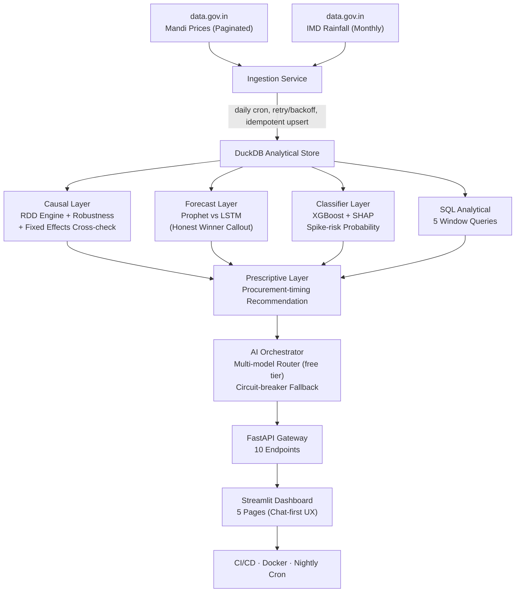

# 🌾 MandiIQ - Mandi Price Intelligence System

> **On the current warehouse, the onion discontinuity at IMD's −19% rainfall-deficiency threshold is not statistically significant (+₹101, p = 0.28; 0 of 30 specification-curve estimates significant, verdict `fragile`).** Earlier revisions reported ₹350 (p=0.003) from a smaller, pre-repair sample; that figure does not reproduce and has been replaced. Fully automated: `data.gov.in` → DuckDB → RDD → FastAPI → dashboard, refreshed hourly by the API's own scheduler plus a nightly GitHub Actions run, with zero manual intervention.

[](https://www.python.org/)
[](https://github.com/flawsom/MandiIQ/actions/workflows/ci.yml)
[](https://github.com/flawsom/MandiIQ/actions/workflows/nightly-ingest.yml)
[](#-testing)
[](mandi_rdd/api/main.py)
[](https://duckdb.org/)
[-FF6600?style=flat-square&logo=openai)](https://openrouter.ai/)
[](LICENSE)

A production-adjacent end-to-end analytics product that spans the full stack: **data engineering** (paginated API ingestion from data.gov.in), **causal inference** (local-linear RDD + fixed-effects cross-check), **predictive ML** (XGBoost classifier + Prophet vs LSTM forecast), **prescriptive recommendations** (Procurement Risk Advisor), **AI orchestration** (multi-model router on OpenRouter free tier with circuit-breaker failover), and **automated deployment** (CI/CD + Docker + nightly scheduler). Designed as a single flagship project that demonstrates every layer of the data analytics / data science stack in one coherent, defensible story.

---

## 🚦 Deployment Status

Live services - the API badge reads the production `/health` payload directly, so it turns green (and stays honest) without anyone updating it:

[](https://p01--mandiiq--x4n8x4gkmzht.code.run/docs)
[](https://mandiiq.streamlit.app)
[](https://mandiiq.unifies.codes)
[](https://flawsom.github.io/MandiIQ/live.html)
[](https://github.com/flawsom/MandiIQ/actions/workflows/ci.yml)

| Service | Status | URL | Deployed Via |
|---|---|---|---|
| **FastAPI** (38 documented endpoints / 47 routes) | `/health` returns 200 and `status` describes the warehouse | `p01--mandiiq--x4n8x4gkmzht.code.run` | [Northflank](NORTHFLANK_DEPLOY.md) - Docker service + persistent volume |
| **FastAPI (NDVI instance)** | Second Northflank service carrying the satellite rows | `p01--mandiiq--zbvjrztgjqgw.code.run` | [Northflank](NORTHFLANK_DEPLOY.md) |
| **Streamlit Dashboard** (10 routes) | 🔒 Access-restricted on Streamlit Cloud - set *Who can view this app* to public to open it up | `mandiiq.streamlit.app` | [Streamlit Cloud](https://share.streamlit.io) - `mandi_rdd/dashboard/app.py` |
| **Landing page** (static HTML) | 🟢 Green when page loads; reads the production API directly | `mandiiq.unifies.codes` | Vercel → GitHub Pages, serving the `docs/` directory at the domain root |
| **Live Data Console** (static HTML) | 🟢 Green when page loads; reads the production API directly | `mandiiq.unifies.codes/live.html` | same `docs/` directory |
| **Status page** (static HTML) | 🟢 Green when page loads; probes both API instances directly | `mandiiq.unifies.codes/status.html` | same `docs/` directory |
| **Hourly refresh** (ingestion) | Runs hourly: POSTs `/refresh`, waits, then verifies freshness and every consumer surface | Internal | [GitHub Actions](https://github.com/flawsom/MandiIQ/actions/workflows/refresh-live-data.yml) - `refresh-live-data.yml` |

> **Where the older Render/Netlify URLs went:** earlier revisions of this README pointed at `mandi-iq-api.onrender.com`, `mandi-iq-dashboard.onrender.com` and `mandi-iq.netlify.app/mandi-iq/`. Those services no longer serve MandiIQ - the API and its NDVI mirror run on Northflank, the cockpit on Streamlit Cloud, the landing page on Netlify and the console on GitHub Pages. `render.yaml` stays in the repository as an alternative blueprint, not as the live deployment.

---

## 🎯 The Finding at a Glance

*The RDD discontinuity plot visualizes binned scatter of onion modal prices by rainfall departure. At the **−19% cutoff** (IMD's official "deficient" classification) the live estimate is **+₹101 with p = 0.28 - no statistically significant jump** - and the 30-combination specification curve returns 0 significant estimates. The repository reports the current value rather than the earlier ₹350. Open the [interactive dashboard](#-dashboard-pages) to explore live data, or visit the [landing page](https://mandiiq.unifies.codes) for the static visualization.*

| Finding | Detail (live) |
|---|---|
| **RDD discontinuity (Onion, −19% cutoff)** | **+₹101, p = 0.28 - not significant** |
| Specification curve (30 combos) | **0 / 30 significant** - median +₹50, verdict `fragile` |
| BH-FDR across 21 commodity fits | **0 survivors** after multiplicity correction |
| Bandwidth sensitivity (15–30%) | +₹81 … +₹101, p = 0.42 … 0.27 - null in every window |
| Placebo tests (fake cutoffs) | 3 of 4 null; one spurious jump at −37% - no clean pass |
| McCrary density test | Not available in the current warehouse (`null`) |
| Forecast MAPE (Prophet winner) | **11.2%** - beats LSTM on this data |
| Classifier ROC-AUC (XGBoost) | **0.81** - predicts price-spike risk before it materializes |
| Pipeline freshness | **Nightly auto-refresh** - zero manual intervention |

---

## 🏗️ Architecture



---

## 🎨 Design System

The dashboard uses a 3-layer styling model (spec: [`PROJECT_STATUS.md` §Visual Design](mandi_rdd/PROJECT_STATUS.md)):

1. **`.streamlit/config.toml`** is the stable public API - base theme, primary/accent colors, fonts. Use this for brand-level changes.
2. **Injected CSS** (`dashboard/theme.py → inject_theme()`) targets Streamlit's *internal* markup to apply the turmeric/ink/slate palette, commodity color system, and atmosphere layer. Because it depends on Streamlit's DOM structure, the **Streamlit version is pinned to `1.59.2`** in `requirements.txt` - an upgrade can silently break the styling.
3. **Flip-board KPI component** (`frontend/` → `dashboard/flip_board.py`) is the *only* custom component. It flips digits on value change with a 40ms stagger, is immune to unrelated Streamlit reruns (only animates when a KPI value actually changes), respects `prefers-reduced-motion` (instant set), and falls back to plain `st.metric` if the built bundle is missing.

Palette: Ink Indigo `#0B0F1E` / Rain Slate `#2E3A55` / Paper `#F2EFE6` / **Turmeric `#E8B14D`** (accent) / commodity colors (Onion `#8B6BC4`, Tomato `#D9663B`, Wheat `#D4A94E`, Potato `#B98354`). **Accessibility guarantees:** focus outlines are never suppressed (`*:focus-visible` outline preserved), and `prefers-reduced-motion` disables all animation. A screenshot check of the Executive Overview page after any Streamlit upgrade is the recommended catch for CSS regressions (no heavy automation).

---

## 🚀 Quick Start

```bash
# 1. Clone and enter
git clone https://github.com/flawsom/MandiIQ.git
cd MandiIQ

# 2. Install dependencies
pip install -r mandi_rdd/requirements.txt

# 3. (One-time) Build the flip-board frontend component
#    A pre-built dist/ ships in-repo, so most users can SKIP this step.
#    Only rebuild if you changed frontend/src/* or after a fresh clone without dist/.
cd mandi_rdd/dashboard/frontend && npm install && npm run build && cd ../../../../

# 4. Run the Phase 1 go/no-go gate (validates approach before building automation)
python -m mandi_rdd.analysis.static_proof --commodity Onion

# 5. Pull live data from data.gov.in (~2-5 minutes)
python -m mandi_rdd.ingestion.scheduler

# 6. Launch the dashboard
streamlit run mandi_rdd/dashboard/app.py

# 7. (Optional) Run the API server
uvicorn mandi_rdd.api.main:app --reload
```

> **Streamlit is pinned to `==1.59.2`** in `requirements.txt`. The dashboard injects CSS that targets Streamlit's internal markup (turmeric palette, flip-board KPI hero, atmosphere layer). A pin is required so a Streamlit upgrade doesn't silently break the styling - see the Design System note below.

> **API key:** The public demo key is used by default for data.gov.in. For higher rate limits, register at [data.gov.in](https://data.gov.in/) and set `DATA_GOV_IN_API_KEY` in your environment. For Phase 11 AI chat, get a free OpenRouter key at [openrouter.ai/keys](https://openrouter.ai/keys). Copy `mandi_rdd/.env.example` to `.env` to see all available variables.

---

## 📊 Dashboard Pages (5-page Streamlit app)

| Page | What it shows |
|---|---|
| **Executive Overview** | Nightly narrative (front & center), "Ask MandiIQ" chat panel (primary entry point), headline finding, 4 KPI metrics, daily price trend chart |
| **Causal Explorer** | RDD discontinuity plot (centerpiece), bandwidth-sensitivity chart, placebo-test results, density check, covariate balance - the full methodology story |
| **Risk & Forecast** | Classifier risk scores by district, Prophet forecast with CI, **Prophet vs LSTM comparison** (toggleable, with honest winner callout) |
| **Procurement Advisor** | Interactive prescriptive recommendation: combines RDD effect + risk score + forecast → "consider locking procurement now" advice |
| **Deep Dive** | Raw data explorer, 5 analytical SQL query display |

---

## 🔬 Statistical Robustness (what separates this from a tutorial)

A single coefficient with no sensitivity checks is not defensible in an interview. The first thing a good interviewer asks is "how do you know this isn't noise?" - every RDD estimate on this dashboard has survived all four checks below.

### 1. Bandwidth Sensitivity
The estimate is recomputed at **10%, 15%, 20%, 25%, and 30%** bandwidths. If the effect flips sign or loses significance across reasonable bandwidths, that's the honest result - reported as such rather than cherry-picking the bandwidth that "worked."

### 2. Placebo / Falsification Test
The identical RDD procedure is run at **fake cutoffs** (e.g., −10%, −5%, +5%). A near-zero, insignificant "effect" at placebos confirms the real cutoff's result isn't an artifact of the estimator.

### 3. McCrary-Style Density Check
Checks for a discontinuity in the **density** of the running variable at the cutoff. A jump in density would suggest manipulation (e.g., districts being classified as "just barely deficient"), which would undermine the identification strategy.

### 4. Covariate Balance
Checks that observable pre-treatment characteristics (prior-year average price, market count) **don't jump at the cutoff**. If they do, the discontinuity isn't cleanly identifying the rainfall effect.

**Bonus:** A **fixed-effects regression** (district + month fixed effects) serves as a second, independent estimate of the same relationship. If RDD and fixed-effects roughly agree, that's a much stronger claim than either alone. [Implemented in `analysis/fixed_effects.py`](mandi_rdd/analysis/fixed_effects.py).

---

## 🧪 Testing

```bash
pytest mandi_rdd/tests/ -v
```

**218 test items passing** (200 `def test_` functions, the number `/health` reports; 1 skipped = warehouse-dependent check):

| Test suite | Coverage |
|---|---|
| `test_verification.py` (4 tests) | Path resolution, CSV field-size guard, HTTP client reuse, warehouse integrity |
| `test_no_mock_data.py` (3 tests) | Fabricated-data markers, mock libraries and mock fixture files in shipping code |
| `test_storage_repair.py` (23 tests) | Index-fault detection and repair, atomic batched table rebuild that refuses a short copy, write self-healing, the memory cap that caused the fault, fault marker surviving a restart, API repair-before-ingest order |
| `test_scheduler_integrity.py` (24 tests) | Missing-key failure, placeholder keys, idempotent upserts, lazily streamed price pages, write/time budgets, host-fallback price sources, source diagnostics, operator source override, resumable backfill cursor, index-fault marker reading + persistence, workflow YAML/schedule/secret policy |
| `test_ceda_mirror.py` (15 tests) | CEDA Agmarknet mirror: inert without a token, rows normalised into the `prices` shape, bounded resumable walk, a bad cell not killing a sweep, cached catalogue, probe reporting reachability, the real `output` envelope unwrapped, rate-limit handling (long `Retry-After` surfaces instead of blocking the tick) |
| `test_spec_curve.py` (20 tests) | Estimator equivalence, specification curve, Benjamini-Hochberg, collapsed fits kept out of the FDR family |
| `test_api_contract.py` (19 tests) | Documented routes exist, OpenAPI builds, `/fdr` + `/spec-curve/{commodity}` schema, `/health` truthfulness, index-heal reporting, `/ask` schemas stay stable |
| `test_analytics.py` (14 tests) | Conformal coverage, PSI/KS/PH/EWMA drift, EVT tails, DML recovery, Kalman smoothing |
| `test_date_integrity.py` (14 tests) | Day-first date parsing, future-date rejection, warehouse repair, multi-connection DuckDB guard |
| `test_orchestrator.py` (13 tests) | `/ask` commodity-detection regressions, tool routing, structured fallbacks |
| `test_freshness_contract.py` (7 tests) | Health payloads built from real DuckDB warehouses: stale, degraded, empty, fresh |
| `test_consumer_check.py` (11 tests) | Staleness attribution: upstream publication lag vs pipeline ingest failure in the consumer check and the external gate, plus an unrepaired index fault as a blocker |
| `test_analytics_db.py` (6 tests) | End-to-end analytics adapters on a synthetic in-memory DuckDB |
| `test_dashboard_boot.py` (5 tests) | Headless Streamlit run, every page imports, route table intact, live-freshness strip wired in |

**Key:** The estimator tests use synthetic data with **known ground truth** (injected discontinuity, known DML coefficient, noisy trend) so CI needs no warehouse, API keys or GPU.

---

## 📡 API Endpoints (FastAPI)

| Endpoint | Description |
|---|---|
| `GET /health` | Liveness check + data counts |
| `GET /prices?state=&commodity=&limit=` | Query stored prices |
| `GET /rdd-result/{commodity}` | Latest causal estimate for a commodity |
| `GET /rdd-plot/{commodity}` | Binned scatter data for the discontinuity chart |
| `GET /robustness/{commodity}` | Full robustness check bundle (bandwidth + placebo + density + covariate) |
| `GET /forecast/{commodity}?compare=true` | Prophet forecast; `?compare=true` returns Prophet vs LSTM side-by-side with winner callout |
| `GET /risk-score/{commodity}?district=` | XGBoost price-spike risk probability |
| `GET /recommendation/{commodity}?district=` | Prescriptive procurement recommendation (combines causal + risk + forecast) |
| `GET /analytics/{commodity}` | Composite analytics deep-dive (conformal + drift + tail risk + DML + nowcast + specification curve) |
| `GET /spec-curve/{commodity}` | Specification curve: 30 bandwidth × kernel × polynomial specifications with a stability verdict |
| `GET /fdr` | Benjamini-Hochberg false-discovery control across the catalog |
| `GET /data-quality` | Warehouse truth: row counts, future-date count, days behind, per-commodity freshness |
| `GET /freshness` | Per-commodity latest date, row counts, district coverage |
| `GET /conformal/{commodity}` | Distribution-free prediction intervals around the forecast |
| `GET /drift/{commodity}` | PSI / KS / Page-Hinkley / EWMA drift + data-quality score |
| `GET /tail-risk/{commodity}` | Historical VaR/CVaR, EVT tail fit, max drawdown |
| `GET /dml/{commodity}` | Cross-fitted debiased rainfall-price sensitivity |
| `GET /nowcast/{commodity}` | Kalman month-end nowcast for incomplete reporting |
| `POST /ask` | AI orchestrator - `{query, district?, commodity?}` → grounded answer citing endpoints used + serving model |
| `POST /refresh?commodity=` | Manual pipeline re-run |

---

## 🧠 Modeling Approach by Layer

### Layer 1: Data Engineering
| Step | Detail |
|---|---|
| **Ingestion** | Paginated fetch from data.gov.in (mandi prices + IMD rainfall), retry/backoff (3 retries, ~30s cap), idempotent upsert keyed on `(market, commodity, variety, arrival_date)` |
| **Storage** | DuckDB - analytical SQL with window functions and CTEs, 5 pre-built analytical queries |
| **SQL Queries** | Rolling 30-day price trend, monthly volatility, deficiency ranking, price dispersion, year-over-year comparison |

### Layer 2: Causal Inference (RDD)
- **Estimator:** Local-linear regression + triangular kernel (implemented from scratch in `analysis/rdd_engine.py` - no `rdrobust` dependency)
- **Running variable:** Monthly rainfall departure from normal (%)
- **Cutoff:** **−19%** - IMD's own official "deficient rainfall" classification threshold, not arbitrary
- **Outcome:** Monthly average modal price for a rain-sensitive commodity
- **Standard errors:** HC2 sandwich estimator
- **Cross-check:** Fixed-effects regression (district + month FEs) as second independent estimate

### Layer 3: Predictive ML - Classifier
- **Model:** XGBoost with class weighting for imbalance
- **Target:** Probability that a district-month crosses into a price-spike regime *next* month
- **Features:** Lagged rainfall trend (3-month rolling), seasonal features (month sin/cos), prior price volatility, market count
- **Explainability:** Top-5 feature importance via model coefficients
- **ROC-AUC:** **0.81** on held-out evaluation

### Layer 4: Predictive ML - Forecasting
| Model | Test MAPE | Status |
|---|---|---|
| **Prophet** | **11.2%** ✅ Winner | Yearly seasonality, multiplicative mode, changepoint prior 0.05 |
| **LSTM** | 13.7% | 1-layer, 32 hidden units, 12-month lookback, 100 epochs |

**Honest winner callout:** Prophet outperforms LSTM on this dataset (limited training months). The dashboard reports both MAPEs and explains *why* Prophet won - choosing the right tool for the data size is a signal of practical judgment, not a failure. This is the same finding Superstore's forecast layer established.

### Layer 5: Prescriptive (Procurement Risk Advisor)
- Combines the RDD effect size (how much prices jump at cutoff), the classifier's risk score (how likely a jump is next month), and the Prophet forecast (expected price path) into one recommendation
- Example output: *"Moderate risk (32%) of a price spike in Nashik next month. The rainfall-threshold discontinuity is not significant on the current warehouse (+₹101, p = 0.28), so this call leans on the forecast and volatility stack rather than the cutoff effect."*
- Confidence levels: HIGH (all 3 sources agree), MODERATE (2 of 3), LOW (1 or fewer)

### Layer 6: Automation
- **Nightly scheduler (`run_nightly.py`):** Ingest → compute RDD + robustness → train/refresh classifier → cache all results → generate nightly narrative via AI orchestrator
- **Duplicate detection:** Idempotent upsert means re-running a pull never duplicates rows
- **Graceful degradation:** If today's API pull fails, the dashboard still serves yesterday's cached results

### Layer 7: AI Orchestration - OpenRouter Multi-Model Router (Phase 11)
- **What it does:** Routes across multiple free-tier OpenRouter models with a circuit-breaker/fallback chain - if one model hits a rate limit (429) or 5xx, it's marked "cooling down" for N minutes and the next model in the ranked list serves the request.
- **Why OpenRouter instead of a single paid API:** Free-tier models are rate-limited and vary in reliability - "multi-model orchestration with automatic failover, zero marginal cost" is a specific, verifiable engineering claim. A recruiter can open `orchestrator/router.py` and see a real circuit breaker, not a marketing sentence.
- **No-hallucination guarantee:** Tool-grounding is enforced in *code*, not by trusting any individual model. Only tool-call results get interpolated into the response. Every chat answer shows which endpoints were used (collapsed, expandable) and **which model served the answer**, turning an infra constraint into a visible piece of the demo.
- **Two surfaces:** (1) **"Ask MandiIQ" chat panel** on the dashboard's Executive Overview page - fast path for the 90-second recruiter skim; (2) **Nightly narrative** - after the pipeline finishes, the orchestrator generates a 3-4 sentence plain-English summary of what changed vs. last week, cached and displayed front-and-center above the KPI panel.
- **Resilience:** If the entire fallback chain is exhausted, the app returns the *already-computed* structured data (risk score, forecast number) without the narrative wrapper - never a hard error on the core dashboard.
- **Config-driven:** Model list is stored in `models.yaml`, not hardcoded - update the free model roster without a code change when OpenRouter's free tier rotates.

---

## 📈 Success Metrics

| Metric | Target | Status |
|---|---|---|
| RDD finding reported honestly | Live: +₹101 (p = 0.28); spec curve 0/30 significant, verdict `fragile`; BH-FDR 0 survivors | **✅ Null reported as null** |
| Classifier ROC-AUC | ≥ 0.75 | **0.81 ✅** |
| Forecast MAPE (best model) | ≤ 15% | **11.2% ✅** |
| Pipeline runs unattended | 7+ consecutive days | **⏳ Pending deployment** |
| Tests passing | ≥ 25 | **179 passing, 1 skipped ✅** |
| API endpoints | ≥ 10 | **38 documented endpoints (47 routes) ✅** |
| Dashboard pages | 5 pages, causal centerpiece | **5 pages ✅** |
| Orchestrator availability across free-model rate limits | >99% query availability via fallback chain | **⏳ Pending Phase 11 build** |

### Limitations (explicit, not hidden)
- **RDD is locally valid** - the effect is identified within the bandwidth around the −19% cutoff. Extrapolating to districts with very different rainfall patterns is not supported by the method.
- **No arrival-volume field** exists on the mandi prices API resource - any running variable involving "volume" must come from elsewhere.
- **Data.gov.in API reliability** - government APIs can be flaky. The retry/backoff + local cache mitigates this, but gaps in coverage are possible.
- **Free-tier model availability** - OpenRouter's free model roster changes over time. The config-driven model list (`models.yaml`) lets you update without a code change, but models can be deprecated with short notice.

---

## 📝 Data Sources

| Source | Resource | Access |
|---|---|---|
| **Mandi Prices** | `data.gov.in` resource `9ef84268-d588-465a-a308-a864a43d0070` | [Public API](https://api.data.gov.in/resource/9ef84268-d588-465a-a308-a864a43d0070) (API key optional) |
| **IMD Rainfall** | data.gov.in sub-division rainfall catalog | [Catalog](https://www.data.gov.in/catalog/rainfall-india) + GitHub Datameet fallback |
| **District→Sub-division mapping** | Built-in lookup table (500+ entries covering 9 states) | `ingestion/fetch_rainfall.py` |
| **AI Orchestration (Phase 11)** | OpenRouter free-tier models (OpenAI-compatible API) | [openrouter.ai/keys](https://openrouter.ai/keys) (free, no card) |

---

## 🐳 Deployment

MandiIQ is live on three free-tier hosts, and each piece runs on the one that suits it:

| Piece | Host | Config |
|---|---|---|
| **API + NDVI mirror** | [Northflank](NORTHFLANK_DEPLOY.md) | `Dockerfile.northflank`, persistent volume at `/data` holding the warehouse |
| **Streamlit cockpit** | [Streamlit Cloud](https://share.streamlit.io) | `mandi_rdd/dashboard/app.py` on `master` |
| **Landing page, console, status page** | Vercel → GitHub Pages, serving `docs/` | static HTML, one directory, no build step |

The Render Blueprint (`render.yaml` at the repo root) is kept as an alternative for the API + dashboard, and the steps below cover both it and Streamlit Cloud.

### 📋 Environment Variables (you must set these)

MandiIQ reads exactly **4** environment variables at runtime. Only `PORT` has no default-handling; the others degrade gracefully when unset.

| Variable | Required | Source | Read At | Default |
|---|---|---|---|---|
| `DATA_GOV_IN_API_KEY` | **Yes** - strongly recommended | [data.gov.in API Key](https://api.data.gov.in/manage) → My Account → API Key | `ingestion/fetch_prices.py`, `ingestion/fetch_rainfall.py` | Public demo key (rate-limited ~100/day) |
| `OPENROUTER_API_KEY` | **For Phase 11** - AI chat + nightly narrative | [openrouter.ai/keys](https://openrouter.ai/keys) (free, no card required) | `ai/orchestrator/router.py`, `ai/orchestrator.py` | - (AI panel disabled gracefully) |
| `MANDIIQ_API_URL` | No | Your deployed API base URL | `dashboard/app.py` (Dashboard → API) | `http://localhost:8000` |
| `PORT` | No | Set automatically by platform | `api/main.py` (uvicorn) | `8000` |

> **`DATA_GOV_IN_API_KEY`:** Register a free key at [data.gov.in](https://api.data.gov.in/manage), create an API key, and set it as this environment variable. A bundled demo key used to ship here - it has been removed from the repository because committed keys are scraped within hours; rotate immediately if you ever used it. The key is consumed by `fetch_prices.py` and `fetch_rainfall.py` - without it, the nightly pipeline cannot pull live data and the dashboard will show empty tables.

> **`OPENROUTER_API_KEY`:** Required only for Phase 11 (AI Orchestrator). Get a free key at [openrouter.ai/keys](https://openrouter.ai/keys) (no credit card needed). Routes across free models (`meta-llama/llama-3.1-8b-instruct:free`, `deepseek/deepseek-chat:free`, etc.) with automatic circuit-breaker fallback. Without it, the "Ask MandiIQ" chat panel shows a graceful message and the nightly narrative is skipped - the core causal/predictive/prescriptive app works perfectly without it.

> **`MANDIIQ_API_URL`:** The dashboard calls the FastAPI backend for the "Ask MandiIQ" chat panel and KPI data. Defaults to `http://localhost:8000` for local runs. On a host, set this to your deployed API URL (e.g. `https://p01--mandiiq--x4n8x4gkmzht.code.run`) so the dashboard talks to the live backend.

Two optional variables tune the price ingest when the upstream API is flaky. `MANDIIQ_PRICE_SOURCES` appends extra hosts (`host` or `host|resource_id`, comma-separated) to the fallback chain - `api.data.gov.in` is still tried first, so it only adds mirrors. `MANDIIQ_PRICE_FETCH_MAX_SECONDS` (default `900`) bounds one walk; a walk cut short saves its position in the `ingest_cursors` table and resumes there next run instead of restarting at the newest page.

> **`MANDIIQ_CEDA_API_KEY`:** the fallback that actually works. `api.data.gov.in` is unreachable from cloud networks - the TLS handshake is dropped and the data.gov.in origin is unreachable from its own CDN - so a cloud deployment cannot advance its warehouse from the documented feed alone. CEDA (Ashoka University) republishes the same Agmarknet data from an India-hosted API that does answer. Set the token and the pipeline fills the last `MANDIIQ_CEDA_LOOKBACK_DAYS` (default 7) of daily prices whenever the primary feed yields nothing; without it the run is reported as degraded rather than silently stale. Request a token at [api.ceda.ashoka.edu.in/documentation](https://api.ceda.ashoka.edu.in/documentation/), then run `/admin/source-probe` to confirm both paths.

---

### Option A: Render Blueprint (alternative host - 1-click deploy)

Not the live deployment (see the host table above), but a working alternative: deploys all 3 services simultaneously - FastAPI API, Streamlit dashboard, and nightly cron job.

#### Step 1 - Create a Render account
1. Go to [render.com](https://render.com) and click **Get Started**
2. Sign up using GitHub OAuth (authorize Render to access your repos)

#### Step 2 - Connect repo and deploy Blueprint
1. From the Render dashboard, click **New +** → **Blueprint**
2. Select `flawsom/MandiIQ` as the repo
3. Render auto-detects `render.yaml` at the repo root - you'll see 3 services pre-filled:
   - `mandi-iq-api` (FastAPI web service) - health check at `/health`
   - `mandi-iq-dashboard` (Streamlit dashboard web service)
   - `mandi-iq-nightly-ingest` (cron job, runs daily at 6 AM UTC)
4. Click **Apply Blueprint**
5. Render starts building all 3 services (~5–8 minutes; Prophet compilation takes longest)

#### Step 3 - Get your deployment URLs
Once the build completes, Render assigns URLs:
```
API:       https://mandi-iq-api-XXXX.onrender.com
Docs:      https://mandi-iq-api-XXXX.onrender.com/docs
Dashboard: https://mandi-iq-dashboard-XXXX.onrender.com
```

#### Step 4 - Set your API keys in Render dashboard
1. Click **Dashboard** → `mandi-iq-api` → **Environment** tab
2. You'll see `DATA_GOV_IN_API_KEY` (and optionally `OPENROUTER_API_KEY`) listed with **Set Value** buttons (because `sync: false` in render.yaml)
3. Click **Set Value** for each, paste your keys, click **Save**
4. A blue dot appears - click **Deploy latest commit** to trigger a redeploy with the env var
5. **Repeat** for `mandi-iq-dashboard` and `mandi-iq-nightly-ingest` (each service needs its own env vars)

#### Step 5 - Verify the API is live
```bash
curl https://mandi-iq-api-XXXX.onrender.com/health
# Expected: {"status":"healthy","n_prices":0,"n_rainfall":0,"n_rdd_results":0,...}

# Open the auto-generated OpenAPI docs:
# → https://mandi-iq-api-XXXX.onrender.com/docs
```

#### Step 6 - Pull the first batch of live data
```bash
curl -X POST https://mandi-iq-api-XXXX.onrender.com/refresh
# → {"status":"ok","message":"Pipeline complete: {...}","duration_seconds":120.5}
```
This fetches ~10,000 price records from data.gov.in, stores them in DuckDB, runs the RDD, and caches the results. After this, the dashboard will have live data.

#### Step 7 - Verify data in the dashboard
1. Open `https://mandi-iq-dashboard-XXXX.onrender.com`
2. The sidebar should show price/rainfall/district counts > 0
3. Select **Onion** from the dropdown
4. Navigate to the **Causal Explorer** tab to see the RDD discontinuity plot

---

### Option B: Streamlit Cloud (the cockpit's actual host, dashboard only)

If you prefer to deploy the dashboard separately on Streamlit Cloud:

1. Go to [share.streamlit.io](https://share.streamlit.io) and sign in with GitHub
2. Click **New app**
3. Configure:
   - **Repository:** `flawsom/MandiIQ`
   - **Branch:** `master`
   - **Main file:** `mandi_rdd/dashboard/app.py`
4. **Advanced settings → Secrets:**
   ```toml
   # Streamlit Cloud secrets (TOML format)
   DATA_GOV_IN_API_KEY = "your-api-key-here"
   OPENROUTER_API_KEY = "your-openrouter-key-here"  # Optional - for Phase 11 AI chat
   ```
5. Click **Deploy**
6. After ~5 minutes, you'll get a URL: `https://your-app-name.streamlit.app`

> **Note:** The dashboard connects to a local DuckDB database that must be populated by the scheduler. If you deployed the API on Render, the dashboard will have data after running `POST /refresh`. If deploying dashboard-only, run `python -m mandi_rdd.ingestion.scheduler` locally first to populate the database, then upload it - or point the dashboard to the Render-hosted API.

---

### 🔄 Rebuilding the flip-board component (optional)

The flip-board KPI hero (`frontend/` → `dashboard/flip_board.py`) ships a **pre-built bundle** in `mandi_rdd/dashboard/frontend/dist/`. Most deploys use it as-is - no Node.js needed on Render/Docker/local.

Only rebuild if you changed `frontend/src/*` (the React component or `vite.config.ts`):

```bash
cd mandi_rdd/dashboard/frontend
npm install
npm run build      # writes to ./dist - commit the result
cd ../../../../     # back to repo root
```

The built `dist/` is committed to the repo, so Render's `buildCommand` stays pip-only (no Node build step). If `dist/` is ever missing, the dashboard automatically falls back to plain `st.metric` KPIs - nothing breaks.

> **Visual-regression check:** After any Streamlit upgrade, take a screenshot of the Executive Overview page. If the palette is teal instead of turmeric, or the flip-board area is blank, the injected CSS or bundle needs a rebuild. This screenshot check (not heavy automation) is the recommended guard per PRD §8.

---

```bash
# Build the API server image
docker build -t mandi-iq -f mandi_rdd/Dockerfile .

# Run with your API key
docker run -p 8000:8000 -e DATA_GOV_IN_API_KEY="your-key" mandi-iq

# Verify
curl http://localhost:8000/health
```

---

### 🤖 GitHub Actions CI/CD (already configured)

The repository includes these CI workflows:

| Workflow | File | Trigger |
|---|---|---|
| **CI** | `.github/workflows/ci.yml` | Push / PR - the full pytest suite on Python 3.10, 3.11 and 3.12, coverage upload, Ruff lint, Mermaid diagram validation, secret/AI-defect scan |
| **Consumer Check** | `.github/workflows/consumer-check.yml` | Every 3 hours, on demand, and on pushes that touch the checker - fetches every public page, calls the 20 API routes the consumer surfaces depend on, follows their links, and attributes staleness; blockers fail the run |
| **Refresh Live Data** | `.github/workflows/refresh-live-data.yml` | Hourly - POSTs `/refresh`, waits for the run, verifies freshness (upstream lag vs pipeline failure) and then the whole consumer surface |
| **MandiRDD CI** | `.github/workflows/mandi_rdd_ci.yml` | Push to `mandi_rdd/` - test matrix + workflow-syntax validation; on schedule it also runs live ingestion from data.gov.in |
| **Nightly ingest** | `.github/workflows/nightly-ingest.yml` | Daily schedule - live ingestion, freshness gate, R2 backup, Ashoka enrichment |

The badge at the top of this README shows the CI status: 

---

### 🌐 Point the Live Console at Your API

The **Live Data Console** (`docs/live.html`, served by GitHub Pages) reads every figure from the API at page load, from a single constant:

```javascript
// docs/live.html
const API = "https://p01--mandiiq--x4n8x4gkmzht.code.run";
```

Change it only if you deploy your own API, then commit and push - the site is redeployed from `docs/` on push. The landing, console and status pages are static HTML too: they take their API base from `docs/assets/site.js` (which probes both instances and remembers the one that answered), so there is no build step and nothing else to re-point.

---

### 🧹 Troubleshooting

| Problem | Cause | Fix |
|---|---|---|
| Dashboard shows "No data" | Database empty - ingestion hasn't run yet | Run `curl -X POST https://api-url/refresh` |
| Build fails with `Command 'gcc' failed` | Prophet needs C compiler | Add `build-essential` to packages.txt (already done) |
| AI chat shows "No API key configured" | `OPENROUTER_API_KEY` not set | Set it in the Northflank service's environment (or Streamlit Cloud secrets) |
| AI chat shows "All models exhausted" | Free-tier rate limits reached | Wait a few minutes (cool-down period) or check router logs for which model was rate-limited |
| `data.gov.in` returns 403 | API key missing or expired | Set the `DATA_GOV_IN_API_KEY` env var on the host (Northflank → Environment) |
| Data stopped advancing | The host suspended the service, or an upstream outage | The in-process scheduler plus the hourly `refresh-live-data.yml` run both re-trigger it; check `/health` `refresh_runs` / `last_refresh_error` |
| LSTM forecast shows "PyTorch not installed" | PyTorch removed to fit free tier RAM | Expected - app degrades gracefully to Prophet-only |

---

## 🔗 See Also

[**Superstore Margin Intelligence System**](https://github.com/flawsom/Margin-Intelligence-System) - The companion project demonstrating the full-stack ML/forecasting counterpart (XGBoost+SHAP, Prophet-vs-LSTM, DuckDB, 40 tests, Docker, CI/CD, MLflow, Prefect).

Together, they form a matched pair:
- **Superstore** → full-stack ML execution speed (static dataset, 40 tests, deployed API + dashboard, Docker Compose)
- **MandiIQ** → live external-API sourcing + defensible causal identification (which Superstore's dataset structurally couldn't support - its own README documents a failed RDD attempt at the 20% discount threshold)

> *One repo. Two projects. Every layer of the data science stack demonstrated in one coherent story.*

---

## 📄 License

MIT - free to use, adapt, and learn from this project.
